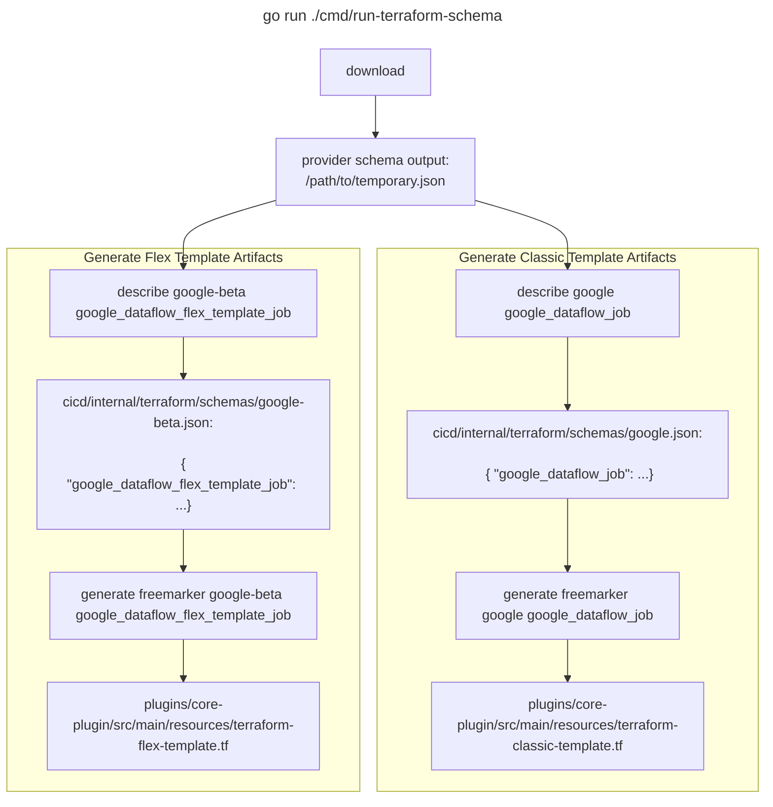

# What is this?

`run-terraform-schema` downloads, describes, and manages tasks related to terraform provider schemas.

# When should it be used?

Whenever the terraform provider schema changes, specifically for Dataflow related resources. Therefore,
usage should be infrequent.

# Why was it made?

The purpose of `run-terraform-schema` is to generate artifacts that are dependencies autogenerate terraform modules.
While `run-terraform-schema` is intended for infrequent use, the Dataflow related resources have
numerous arguments making the generation of said artifact dependencies error-prone when done manually.

# How does it work?

All of its contained subcommands are intended for use as a pipeline, summarized in the diagram below.

First a user runs the `download` subcommand to pull the latest registry schema from the Hashicorp provider registry,
saving the JSON output to a temporary location.
Next a user runs the `describe` subcommand twice for classic and flex templates to filter the raw output from the
previous step. The output of running `describe` is version controlled at [cicd/internal/terraform/schemas](../../internal/terraform/schemas).
Finally, a user runs the `generate freemarker` subcommand, which defaults to using
[cicd/internal/terraform/schemas](../../internal/terraform/schemas) as input, to generate the [freemarker](https://freemarker.apache.org)
used to [autogenerate terraform modules](../../../plugins/templates-maven-plugin/src/main/java/com/google/cloud/teleport/plugin/maven/TemplatesTerraformMojo.java).



# How to use it?

During the infrequent occurrence of Google or Google-Beta provider Dataflow related resource changes,
the following steps illustrate how to generate important artifacts to autogenerate terraform modules.

## Step 1. Download the provider schemas

Run the following to download the provider schemas to a temporary location:

```
go run ./cmd/run-terraform-schema download /path/to/temporary.json
```

## Step 2a. Generate Classic Template Resource Schema and Freemarker Resource

Run the `describe` subcommand to filter the temporary output and store in
[cicd/internal/terraform/schemas/google.json](../../internal/terraform/schemas/google.json)

```
go run ./cmd/run-terraform-schema describe google google_dataflow_job /path/to/temporary.json > internal/terraform/schemas/google.json
```

Finally, run the `generate freemarker` subcommand and store in
[plugins/core-plugin/src/main/resources/terraform-classic-template.tf](../../../plugins/core-plugin/src/main/resources/terraform-classic-template.tf)

```
go run ./cmd/run-terraform-schema generate freemarker google google_dataflow_job ../plugins/core-plugin/src/main/resources/terraform-classic-template.tf
```

## Step 2b. Generate Flex Template Resource Schema and Freemarker Resource

Run the `describe` subcommand to filter the temporary output and store in
[cicd/internal/terraform/schemas/google-beta.json](../../internal/terraform/schemas/google-beta.json)

```
go run ./cmd/run-terraform-schema describe google-beta google_dataflow_flex_template_job /path/to/temporary.json > internal/terraform/schemas/google-beta.json
```

Finally, run the `generate freemarker` subcommand and store in
[plugins/core-plugin/src/main/resources/terraform-flex-template.tf](../../../plugins/core-plugin/src/main/resources/terraform-flex-template.tf)

```
go run ./cmd/run-terraform-schema generate freemarker google-beta google_dataflow_flex_template_job ../plugins/core-plugin/src/main/resources/terraform-flex-template.tf
```

# Getting Help

To show help, run:

```
go run ./cmd/run-terraform-schema
```

You should see the following output:

```
Downloads, describes, and manages tasks related to terraform provider schemas

Usage:
run-terraform-schema [command]

Available Commands:
completion  Generate the autocompletion script for the specified shell
describe    Describe terraform provider schemas.
download    Acquires the schema of terraform providers.
Outputs to FILE, created if needed; outputs to STDOUT if no FILE provided.
generate    Generates content based on terraform provider schemas
help        Help about any command

Flags:
-h, --help   help for run-terraform-schema

Use "run-terraform-schema [command] --help" for more information about a command.
```
