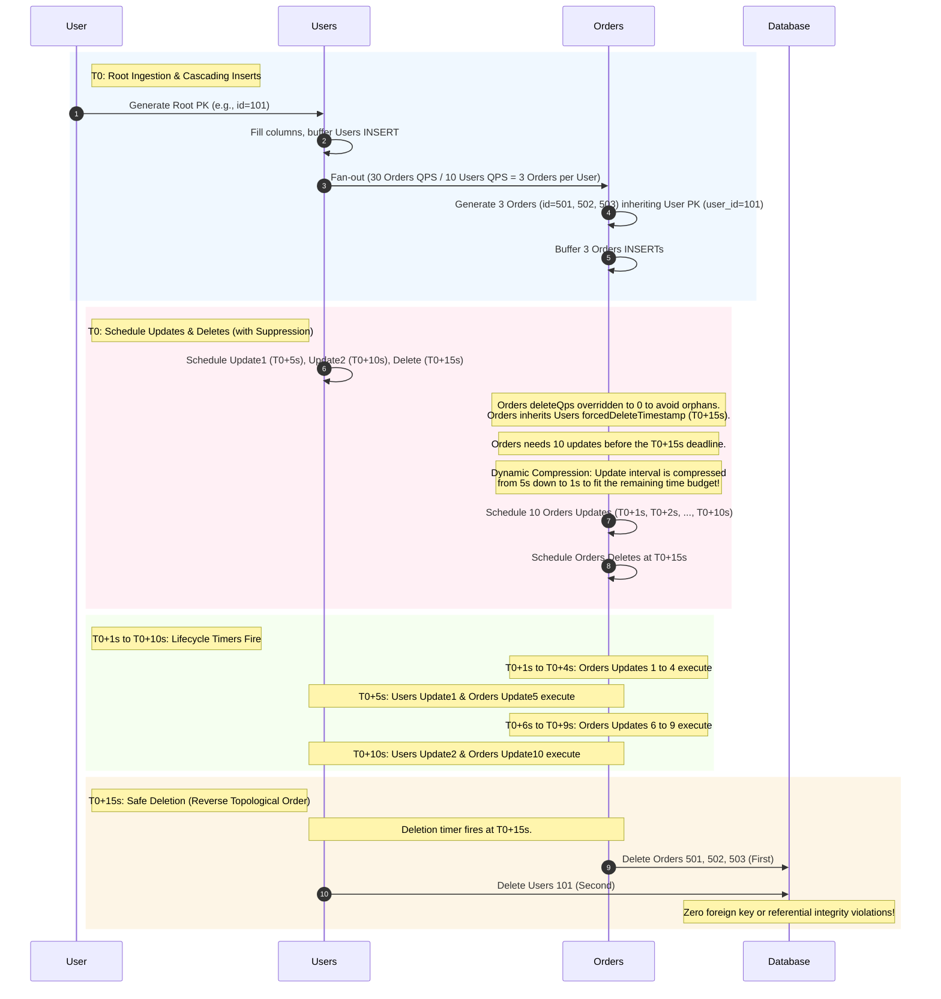

# CDC Data Generator User Guide

The **CDC Data Generator** is a high-throughput, streaming Dataflow template designed to generate realistic `INSERT`, `UPDATE`, and `DELETE` traffic against an existing target schema.

By pointing the pipeline at a Cloud Spanner database or a sharded MySQL database fleet, the generator automatically discovers the target schema, synthesizes well-typed mock records, maintains structural relationships (such as primary keys, foreign keys, unique constraints, and parent-child interleaves), and streams writes at a customizable rate (Queries Per Second, or QPS).

---

## Table of Contents

* [Supported Sinks](#supported-sinks)
* [Core Use Cases](#core-use-cases)
* [How It Works](#how-it-works)
* [Consistency and Ordering Guarantees](#consistency-and-ordering-guarantees)
* [Before You Begin](#before-you-begin)
    * [GCP and Dataflow Prerequisites](#gcp-and-dataflow-prerequisites)
    * [Spanner Sink Prerequisites](#spanner-sink-prerequisites)
    * [MySQL Sink Prerequisites](#mysql-sink-prerequisites)
    * [Sample Spanner Sink-Options File](#sample-spanner-sink-options-file)
    * [Sample MySQL Sink-Options File (Sharded)](#sample-mysql-sink-options-file-sharded)
* [Quickstart](#quickstart)
    * [Staging and Running via Spanner](#staging-and-running-via-spanner)
    * [Staging and Running via MySQL](#staging-and-running-via-mysql)
* [Pipeline Parameters Reference](#pipeline-parameters-reference)
* [End-to-End Persistence Lifecycle Walkthrough](#end-to-end-persistence-lifecycle-walkthrough)
    * [1. Root Record Ingestion (T0)](#1-root-record-ingestion-t0)
    * [2. Cascading Generation & Delete Suppression](#2-cascading-generation--delete-suppression)
    * [3. Dynamic Interval Compression](#3-dynamic-interval-compression)
    * [4. Lifecycle Timer Execution (T0+1s to T0+10s)](#4-lifecycle-timer-execution-t01s-to-t010s)
    * [5. Referential Integrity Safe Deletion (T0+15s)](#5-referential-integrity-safe-deletion-t015s)
* [Schema Overrides Reference (DSL)](#schema-overrides-reference-dsl)
    * [Full HOCON Example](#full-hocon-example)
    * [Field Reference](#field-reference)
    * [Custom Value Generators](#custom-value-generators)
* [Pipeline Architecture](#pipeline-architecture)
    * [Visual DAG Flow](#visual-dag-flow)
    * [Stage Walkthrough](#stage-walkthrough)
* [Observe, Tune, and Troubleshoot](#observe-tune-and-troubleshoot)
    * [Pipeline Metrics](#pipeline-metrics)
    * [Tuning the Knobs](#tuning-the-knobs)
    * [Logs Analysis](#logs-analysis)
    * [Dead-Letter Queue (DLQ) Output](#dead-letter-queue-dlq-output)
    * [Troubleshooting Common Errors](#troubleshooting-common-errors)
* [Limitations](#limitations)
* [Getting Help](#getting-help)

---

## Supported Sinks

The pipeline currently supports generating data for the following target databases:
* **Cloud Spanner** (GoogleSQL and PostgreSQL dialects)
* **MySQL** (Single or Sharded instances)

---

## Core Use Cases

* **Load Testing Migration Pipelines**: Simulate realistic transactional workloads to test the different migration pipelines.
* **Performance Tuning**: Generate high-volume baseline data to stress-test and optimize indices, query execution plans, and replication lag.

---

## How It Works

At a high level, the pipeline goes through the following operational stages at launch:

1. **Schema Discovery**: The pipeline connects to the target sink and reads the system tables or catalog metadata. It builds an in-memory schema representing every table, column type, primary key, foreign key, and parent-child hierarchy.
2. **Apply Configurations**: If you provide an optional HOCON or JSON override config, the pipeline merges it on top of the discovered schema. This lets you override per-table QPS rates, skip generating specific columns, map custom Faker rules, or introduce extra relationship dependencies.
3. **Dependency Sorting**: It sorts the schema tables to ensure that child tables are never written to the database before their parent tables.
4. **Metronome Clock**: A periodic impulse generator fires once every second. This tick is converted into a specific number of root-table operations based on the target QPS.
5. **Stateful Lifecycle Management**: Initial `INSERT` records are distributed evenly across logical state partitions using a hash algorithm. Once ingested, all subsequent `UPDATE` and `DELETE` events are generated in-place by local timers within that exact same state partition, ensuring perfect referential consistency.
6. **Stateful Traversal**: The stateful writer completes missing fields, evaluates cascaded child rows, batches mutations, and executes writes to the target databases.

---

## Consistency and Ordering Guarantees

* **Primary Key Requirement**: Every target table **must** have a defined primary key. Tables without primary keys cannot be tracked in stateful buffers and are filtered out during the schema discovery phase.
* **Static Unique Columns & Foreign Keys on UPDATE**: When generating `UPDATE` events, the values of the primary keys, foreign keys, and any unique key columns are preserved from the original `INSERT` state. The data values for these specific columns remain constant and are not changed by subsequent `UPDATE` operations, which prevents referential integrity errors.
* **No Retries for Database Write Failures**: Write failures (e.g., due to database constraint violations or connection dropouts) are considered final. Failed rows are routed directly to the Dead-Letter Queue (DLQ) and are **not** internally retried by the pipeline.
* **INSERT Order**: Parent rows are always written to the database before child rows. Writes are ordered topologically according to the foreign key hierarchy.
* **DELETE Order**: Child rows are always deleted before their parent rows. Deletions happen in reverse topological order to prevent foreign-key or referential integrity violations.
* **UPDATE Order**: An `UPDATE` on a specific row is guaranteed to be written after its `INSERT` and strictly before its `DELETE`. There is no ordering guarantee between updates of unrelated rows.
* **At-Least-Once Delivery**: Standard Beam at-least-once semantics are supported. The pipeline uses stateful DoFns to store active row states, ensuring that even if workers crash, the lifecycle sequences recover cleanly.
* **Sticky MySQL Sharding**: For MySQL setups, each row selects a shard at insert time and routes every subsequent update or delete to the exact same physical database shard.

---

## Before You Begin

### GCP and Dataflow Prerequisites

1. **APIs Enabled**: Make sure Cloud Dataflow, Cloud Storage (GCS), and (for Spanner) Cloud Spanner APIs are enabled in your project.
2. **Service Account IAM Roles**: The Dataflow worker service account requires the following roles:
    * `roles/dataflow.worker`
    * `roles/storage.objectAdmin` on your temporary and staging GCS buckets.
    * `roles/spanner.databaseUser` on the target Spanner database (Spanner sinks only).
    * `roles/secretmanager.secretAccessor` if your MySQL configuration retrieves passwords using Secret Manager URIs.
3. **Network Connectivity**: Ensure Dataflow workers can communicate with the databases. If writing to MySQL, you may need to allowlist Dataflow IPs or route traffic via a private subnet.
4. **Private IP Execution (Recommended)**: When launching workers, pass the `--disable-public-ips` parameter and specify the `--subnetwork` path to ensure secure execution without public internet access.

### Spanner Sink Prerequisites

* The target Spanner database and its tables must already exist. The generator discovers and writes to existing schemas; it **does not** execute DDL to create tables.
* Both **GoogleSQL** and **PostgreSQL** dialects are supported and auto-detected on startup.
* The configured service account needs standard read and write access to every target table.

### MySQL Sink Prerequisites

* The target tables must exist on all database shards before you run the pipeline.
* The MySQL user requires `INSERT`, `UPDATE`, `DELETE`, and `SELECT` (used to discover schemas) privileges.
* Secure your passwords by storing them in Google Secret Manager and referencing them via `secretManagerUri` in your shard JSON file.

> [!WARNING]
> **Schema Consistency Across Shards**: All database shards listed in your configuration file **must have identical schemas** (same tables, columns, data types, primary keys, and constraints). The generator discovers the schema once using the first database shard in the list, and assumes all other shards are perfectly identical.

> [!TIP]
> **Batching Performance Knob (`rewriteBatchedStatements`)**: If you set `--batchSize` to a value greater than `1`, you **must** append `rewriteBatchedStatements=true` to the `"connectionProperties"` string (e.g., `"connectionProperties": "useSSL=false&rewriteBatchedStatements=true"`) in your MySQL shards config. Without this property, the MySQL JDBC driver compiles batch operations into sequential, single-record statements, completely negating the performance benefit of batching.

### Sample Spanner Sink-Options File

Save this JSON as `spanner_options.json` and upload it to GCS. Pass this path to the `--sinkOptions` parameter:

```json
{
  "projectId": "my-gcp-project",
  "instanceId": "my-spanner-instance",
  "databaseId": "my-database"
}
```

### Sample MySQL Sink-Options File (Sharded)

Save this JSON file containing your database shards as `mysql_shards.json` and upload it to GCS. Pass this path to the `--sinkOptions` parameter:

```json
[
  {
    "logicalShardId": "shard1",
    "host": "10.11.12.13",
    "user": "loadgen_user",
    "secretManagerUri": "projects/123456789/secrets/mysql-pwd-shard1/versions/latest",
    "port": "3306",
    "dbName": "ecom_db_shard1"
  },
  {
    "logicalShardId": "shard2",
    "host": "10.11.12.14",
    "user": "loadgen_user",
    "secretManagerUri": "projects/123456789/secrets/mysql-pwd-shard2/versions/latest",
    "port": "3306",
    "dbName": "ecom_db_shard2"
  }
]
```

* **Note**: If you are testing locally or in a sandbox and don't want to use Secret Manager, you can replace `secretManagerUri` with a plain-text `"password"` key.
* **Optional fields**: You can include `"connectionProperties"` (e.g. `"useSSL=false&allowPublicKeyRetrieval=true"`) to customize your JDBC connection string.

---

## Quickstart

The CDC Data Generator is packaged as a Dataflow Flex Template. To run the pipeline, make sure you have built and staged the container image (for build instructions, refer to the root directory's developer setup).

### Staging and Running for Spanner

```bash
export PROJECT="my-gcp-project"
export REGION="us-central1"
export TEMPLATE_LOCATION="gs://my-bucket/templates/cdc-data-generator.json"

gcloud dataflow flex-template run "cdc-gen-spanner-$(date +%Y%m%d-%H%M%S)" \
  --project="${PROJECT}" \
  --region="${REGION}" \
  --template-file-gcs-location="${TEMPLATE_LOCATION}" \
  --disable-public-ips \
  --worker-machine-type="n2-standard-8" \
  --subnetwork="regions/${REGION}/subnetworks/my-subnet" \
  --additional-experiments=use_runner_v2 \
  --parameters \
sinkType=SPANNER,\
sinkOptions=gs://my-bucket/configs/spanner_options.json,\
batchSize=100,\
insertQps=2000,\
updateQps=500,\
deleteQps=100
```

### Staging and Running for MySQL

```bash
gcloud dataflow flex-template run "cdc-gen-mysql-$(date +%Y%m%d-%H%M%S)" \
  --project="${PROJECT}" \
  --region="${REGION}" \
  --template-file-gcs-location="${TEMPLATE_LOCATION}" \
  --disable-public-ips \
  --worker-machine-type="n2-standard-64" \
  --subnetwork="regions/${REGION}/subnetworks/my-subnet" \
  --additional-experiments=use_runner_v2 \
  --parameters \
sinkType=MYSQL,\
sinkOptions=gs://my-bucket/configs/mysql_shards.json,\
batchSize=100,\
insertQps=4000,\
updateQps=2000,\
deleteQps=100,\
jdbcPoolSize=100,\
schemaConfig=gs://my-bucket/configs/overrides.conf
```

---

## Pipeline Parameters Reference

| Parameter | Required | Default | Description |
| :--- | :---: | :---: | :--- |
| **`sinkType`** | **Yes** | — | The target database engine type. Supported values: `SPANNER` or `MYSQL`. |
| **`sinkOptions`** | **Yes** | — | GCS path to the sink JSON configuration file. For Spanner, this is a database spec. For MySQL, this is a JSON array of database shards. |
| **`batchSize`** | No | `1` | The maximum number of mutations buffered per unique `(table, shard, operation)` combination *within a single Beam bundle* before flushing. Because flushes are bounded by Beam bundles, if a bundle finishes processing before the buffer hits `batchSize`, a flush is forced immediately. Actual batch write sizes may therefore be smaller than this setting. |
| **`insertQps`** | No | `1000` | The **approximate** target insert rate (records per second) applied to each root table. Rates are statistical targets and subject to micro-fluctuations based on worker thread scheduling and probabilistic selection weights. Can be overridden per-table in `schemaConfig`. |
| **`updateQps`** | No | `0` | The **approximate** target update rate (records per second) per table. If set to `0`, updates are disabled. |
| **`deleteQps`** | No | `0` | The **approximate** target delete rate (records per second) per table. If set to `0`, deletions are disabled. |
| **`jdbcPoolSize`** | No | `10` | The maximum number of active connections in the JDBC pool per logical MySQL shard. Only applies to MySQL. |
| **`updateInterval`** | No | `5` | The time interval (in seconds) between consecutive `UPDATE` events for a given row. |
| **`deleteInterval`** | No | `5` | The delay (in seconds) after the final `UPDATE` before a `DELETE` event is written. |
| **`schemaConfig`** | No | — | GCS path to a HOCON or JSON overrides configuration file used to customize data rules. |
| **`dlqDirectory`** | No | — | GCS folder path where failed write records are stored in JSON format. If not specified, failures are logged but not persisted to storage. |
| **`maxParallelism`** | No | *Auto-tuned* | The number of internal parallel partitions used to distribute writes. If not specified, the pipeline automatically sets this value based on the sink type. |
| **`customJarPath`** | No | — | GCS path to a custom JAR file containing a custom data generator implementation. |
| **`customClassName`** | No | — | The fully qualified class name of the custom data generator implementation within the custom JAR. |

### Auto-Tuned Key Parallelism

To avoid writing conflicts, lock contentions, or resource depletion, the pipeline automatically configures the number of partitions (`maxParallelism`) unless you manually override it:
* **Spanner**: Defaults to `100,000` partitions. Spanner scales horizontally, so maximizing internal distribution ensures highly parallel, distributed writes across the Spanner cluster.
* **MySQL**: Defaults to `5,000 * shardCount` partitions. Since MySQL is a traditional relational database with transaction lock pools, a lower partition count prevents the system from exhausting connection pools or causing row deadlocks.

---

## End-to-End Persistence Lifecycle Walkthrough

To illustrate the generator's advanced features—specifically parent-child cascading, delete suppression, and dynamic interval compression—let's walk through a realistic e-commerce scenario with a **Users** table (Parent) and an **Orders** table (Child).

**The Use Case:**
We want to simulate an active e-commerce platform where:
* 10 new Users register every second.
* On average, each User creates 3 Orders (30 total new Orders per second).
* Users occasionally update their profile (20 updates per second across all users).
* Orders change status very frequently, such as moving from 'processing' to 'shipped' (300 updates per second across all orders).
* 50% of Users eventually delete their accounts (5 deletes per second).

Based on this use case, we configure the pipeline with:
* **Users Table**: `insertQps = 10`, `updateQps = 20`, `deleteQps = 5`
* **Orders Table**: `insertQps = 30`, `updateQps = 300`, `deleteQps = 30` (Orders references Users via foreign key)
* **Global Settings**: `updateInterval = 5s`, `deleteInterval = 5s`

Here is the sequence of events for a single User and their Orders:



### 1. Root Record Ingestion (T0)

The impulse metronome triggers generation. The pipeline synthesizes a new primary key for the `Users` table (e.g. `id=101`). The stateful DoFn fills in the remaining user fields and buffers an `INSERT` mutation.

The engine calculates how many updates and deletions the user record should experience before it is cleaned up:
* **Updates**: `updateQps / insertQps = 20 / 10 = 2` updates.
* **Deletions**: `deleteQps / insertQps = 5 / 10 = 0.5` (50% probability of deletion).
Assuming this specific record is selected for deletion, its total lifespan is calculated as:
$$\text{Lifespan} = \text{now} + (\text{updateInterval} \times \text{numUpdates}) + \text{deleteInterval}$$
$$\text{Lifespan} = T0 + (5\text{s} \times 2) + 5\text{s} = T0 + 15\text{s}$$
Thus, the `Users` record schedules `Update1` at $T0+5\text{s}$, `Update2` at $T0+10\text{s}$, and a final `DELETE` at $T0+15\text{s}$.

### 2. Cascading Generation & Delete Suppression

Next, the user record fans out generation to child tables. The fan-out ratio is calculated:
$$\text{Fan-Out Ratio} = \frac{\text{Orders insertQps}}{\text{Users insertQps}} = \frac{30}{10} = 3 \text{ orders per User}$$
The engine generates three distinct order records (e.g. `id=501`, `502`, `503`), automatically passing down the user's primary key value (`user_id=101`) to satisfy the foreign key constraints. The order `INSERT` mutations are buffered.

Because the `User` has a deletion scheduled, **the orders' independent delete schedule is suppressed (set to 0) to prevent out-of-order deletions or double-deletion conflicts**. Instead of deleting themselves at a different or arbitrary time, the order records inherit the user's exact delete deadline of $T0+15\text{s}$. This ensures that **both the user and their orders are deleted together** as part of the same lifecycle teardown, with the order records deleted first during the final transaction flush to respect referential integrity constraints.

### 3. Dynamic Interval Compression

The engine now plans updates for the order records. Based on the order's QPS ratio, each order requires:
$$\text{Updates} = \frac{\text{Orders updateQps}}{\text{Orders insertQps}} = \frac{300}{30} = 10 \text{ updates}$$
Under standard settings, 10 updates spaced 5 seconds apart would require 50 seconds. However, the order records must be deleted along with the user at $T0+15\text{s}$.

To prevent data truncation, **Dynamic Interval Compression** recalibrates the order's update interval. It subtracts the 5-second trailing deletion interval from the user's lifetime, leaving a remaining active window of:
$$\text{Active Window} = 15\text{s} - 5\text{s} = 10\text{s}$$
To execute 10 updates in a 10-second window, the update interval is compressed:
$$\text{Compressed Interval} = \frac{10\text{s}}{10} = 1 \text{ second}$$
Each order schedules 10 updates spaced exactly 1 second apart ($T0+1\text{s}$, $T0+2\text{s}$, ..., $T0+10\text{s}$) and schedules its final `DELETE` at $T0+15\text{s}$.

### 4. Lifecycle Timer Execution (T0+1s to T0+10s)

As processing time advances, the Dataflow worker fires timers. Every second, order updates are synthesized and buffered. At $T0+5\text{s}$, the user's `Update1` timer fires alongside the order's `Update5`. At $T0+10\text{s}$, the user's `Update2` timer and the order's final `Update10` timer execute, leaving the database state completely updated.

### 5. Referential Integrity Safe Deletion (T0+15s)

At $T0+15\text{s}$, the deletion timer fires for both user and order records. As they are pushed into the batch buffer, the batcher flushes the deletes in **reverse topological order** (Orders first, then Users). The database processes order deletions first, clearing the user last. This prevents foreign key constraint violations.

---

## Schema Overrides Reference (DSL)

To fine-tune how fields are generated, pass a configuration file via the `--schemaConfig` parameter.

> [!NOTE]
> **JSON Format Support**: Since standard JSON is a strict subset of HOCON, you can seamlessly provide a standard raw JSON file instead of a `.conf` file if your orchestration prefers JSON objects.

> [!IMPORTANT]
> **Case Sensitivity**: All table and column keys defined inside your configuration file are **strictly case-sensitive**. They must align exactly with the discovered database catalog names.

We highly recommend **HOCON** (Human-Optimized Config Object Notation) because it supports inline comments, unquoted values, and flexible commas.

### Full HOCON Example

Save this config as `overrides.conf` and upload it to GCS:

```hocon
# overrides.conf - Custom data rules
tables {

  # Table names must match the discovered database table names
  Users {
    insertQps = 2000
    updateQps = 500
    deleteQps = 100

    columns {
      # Generate random realistic emails using DataFaker
      email      { generator = "#{internet.emailAddress}" }

      # Fix a column to a static constant for all rows
      country    { generator = "US" }

      # Let the database fill this column using its DEFAULT rule or NULL
      created_at { skip = true }
    }
  }

  Orders {
    insertQps = 6000   # Generates an average of 3 orders per user
    updateQps = 200
    deleteQps = 0

    # Define custom foreign key paths not declared in DDL
    foreignKeys = [
      {
        name              = "custom_orders_user_fk"
        referencedTable   = "Users"
        keyColumns        = ["user_id"]
        referencedColumns = ["id"]
      }
    ]

    columns {
      sku         { generator = "#{commerce.productName}" }
      price       { generator = "#{number.randomDouble '2','10','1000'}" }
      purchase_ip { generator = "#{internet.ipV4Address}" }
    }
  }
}
```

### Field Reference

#### `tables.<TableName>` (Object)

| Field | Type | Description |
| :--- | :---: | :--- |
| `insertQps` | Integer | Target insert rate for this table. Overrides the global `--insertQps` parameter. |
| `updateQps` | Integer | Target update rate for this table. Overrides the global `--updateQps` parameter. |
| `deleteQps` | Integer | Target delete rate for this table. Overrides the global `--deleteQps` parameter. |
| `columns` | Map | Per-column override rules. Keys are the column names, values are `ColumnConfig` objects. |
| `foreignKeys` | List | Extra foreign key boundaries. Names matching an existing database foreign key must align exactly. |

#### `tables.<TableName>.columns.<ColumnName>` (Object)

| Field | Type | Description |
| :--- | :--- | :--- |
| `generator` | String | A DataFaker expression (enclosed in `#{...}`) or a literal value. Replaces default generation. |
| `skip` | Boolean | If `true`, this column is excluded from generated rows. Cannot be set on primary key columns. |

#### `tables.<TableName>.foreignKeys[]` (Object)

| Field | Type | Description |
| :--- | :--- | :--- |
| `name` | String | Unique name for the foreign key relationship. |
| `referencedTable` | String | The target parent table name. |
| `keyColumns` | List<String> | Column(s) on the current table participating in the foreign key relation. |
| `referencedColumns` | List<String> | Columns on the parent table referenced by the relation. |

### Custom Value Generators

You can override data generation using three main formats:
1. **Faker Expressions**: Strings starting with `#{` and ending with `}` are processed by the [DataFaker](https://github.com/datafaker-net/datafaker) library. Any DataFaker provider functions are supported, including:
    * `#{name.firstName}` / `#{name.lastName}` / `#{name.fullName}`
    * `#{address.city}` / `#{address.zipCode}` / `#{address.country}`
    * `#{number.numberBetween '1','100'}`
    * `#{number.randomDouble '4','10','500'}`
2. **Literal Constants**: Plain values (such as `"US"`, `100`, or `false`) are parsed directly into the column's target database type and remain static across all rows.
3. **Custom Java Implementation**: You can provide an external JAR with a custom Java class implementing the [`CustomDataGenerator`](../spanner-migrations-sdk/src/main/java/com/google/cloud/teleport/v2/spanner/utils/CustomDataGenerator.java) interface. Pass the `customJarPath` and `customClassName` pipeline parameters to dynamically load it at runtime. This is useful for complex, stateful, or deterministic data generation scenarios that cannot be expressed via static configuration.

* **Note**: If a Faker expression evaluates to a value that cannot be parsed into the target column's database data type, the pipeline will crash on startup, pointing out the invalid column mapping.

> [!IMPORTANT]
> **Strict ISO-8601 Date & Timestamp Parsing**: In the underlying utility module, date and timestamp column parsing strictly expects standard ISO-8601 strings (e.g., `YYYY-MM-DD` for dates, and `YYYY-MM-DDTHH:mm:ssZ` or `YYYY-MM-DDTHH:mm:ss.SSSZ` for timestamps).
> If a custom literal or a custom Faker date expression (such as `#{date.birthday 'dd/MM/yyyy'}`) is provided, the underlying string parser (`LocalDate.parse()` and `Instant.parse()`) will fail to parse it, throwing a `DateTimeParseException` and causing the pipeline to crash immediately. You must ensure all date/timestamp faker templates output strictly ISO-compliant formats.

---

## Pipeline Architecture

### Visual DAG Flow

```
                 ┌──────────────────────┐
                 │     SchemaLoader     │
                 │  (Side-Input Loader) │
                 └──────────┬───────────┘
                            │ (Side Input)
                            ▼
  ┌──────────────────────────────────────────────────────────────────┐
  │  [Impulse Metronome]                                             │
  │         │ (Periodic 1-Second Trigger)                            │
  │         ▼                                                        │
  │  [ScaleTicksFn] (Tick multiplied by aggregate root-table QPS)   │
  │         │                                                        │
  │         ▼                                                        │
  │  [RedistributeTicks]                                             │
  │  (Redistribute.arbitrarily() to distribute ticks over workers)   │
  │         │                                                        │
  │         ▼                                                        │
  │  [SelectTableFn] (Weighted selection over active schema tables)  │
  │         │                                                        │
  │         ▼                                                        │
  │  [GeneratePrimaryKeyFn] (Generates Primary Key values & Shard ID)│
  │         │                                                        │
  │         ▼                                                        │
  │  [MapToReshuffleKey] (Key: "table#" + Hash(pk) % maxParallelism) │
  │         │                                                        │
  │         ▼                                                        │
  │  [Redistribute] (Redistribute.byKey() to route to state worker)  │
  │         │                                                        │
  │         ▼                                                        │
  │  [BatchAndWriteFn] (Stateful DoFn: completes rows, manages      │
  │         │           timers, cascades children, and batches writes│
  │         ▼                                                        │
  │  ┌───────────────┐               ┌────────────────────────┐      │
  │  │  DataWriter   │               │ GCS DLQ Output Folder  │      │
  │  │ (Spanner/JDBC)│               │  (Failed Records JSON) │      │
  │  └───────────────┘               └────────────────────────┘      │
  └──────────────────────────────────────────────────────────────────┘
```

### Stage Walkthrough

* **SchemaLoader**: Fetches database DDL, applies custom overrides, walks the relationship graph to assign topological depths, and broadcasts the schema map to all workers as a side input.
* **Impulse Metronome**: Emits an execution pulse once every second.
* **ScaleTicksFn & SelectTable**: Multiplies the tick by the cumulative QPS target and dynamically selects the table target based on weighted tree depths.
* **RedistributeTicks**: Uses Apache Beam's `Redistribute.arbitrarily()` to fan out the metronome triggers across all active worker nodes.
* **GeneratePrimaryKeyFn**: Synthesizes the primary key values. For MySQL, it also assigns a logical shard ID to ensure sticky routing.
* **MapToReshuffleKey & Redistribute**: Maps the key based on `Hash(tableName + pk) % maxParallelism` and applies `Redistribute.byKey()` to ensure sticky routing of all subsequent updates and deletes to the exact same stateful worker thread.
* **BatchAndWriteFn**: The stateful engine. It maintains buffers, runs lifecycle timers, cascades child generation, handles database connectivity pools, and routes failed writes to the DLQ.

---

## Observe, Tune, and Troubleshoot

### Pipeline Metrics

Monitor these metrics in the Cloud Dataflow console under the **Job Metrics** tab. All counters are registered under the namespace: `com.google.cloud.teleport.v2.templates.dofn.BatchAndWriteFn`.

| Metric | Type | Meaning / Description |
| :--- | :---: | :--- |
| `insertsGenerated` | Counter | Cumulative count of insert rows synthesized (including cascaded children). |
| `updatesGenerated` | Counter | Cumulative count of update rows synthesized by lifecycle timers. |
| `deletesGenerated` | Counter | Cumulative count of delete rows synthesized by lifecycle timers. |
| `recordsWritten` | Counter | Total rows successfully written to the target databases. |
| `batchesWritten` | Counter | Number of successful database batch writes executed. |
| `writeFailures` | Counter | Number of rows that failed database writes and were routed to the DLQ. |
| `generationFailures` | Counter | Number of rows that failed during synthesis (due to invalid Faker mapping or parsing errors). |
| `unresolvableFkChildrenDropped` | Counter | Child records dropped because their parent records were missing from the active generation context. |
| `recordsWritten_<ShardID>` | Counter | Total successful writes completed against a specific MySQL shard (MySQL only). |

### Tuning the Knobs

* **Avoid Initial Backlog Buildup (Pre-Scale Workers)**: If you are running a pipeline with a high QPS target (e.g. >10,000 inserts/sec), **do not** rely solely on Dataflow's default autoscaling from 1 worker. The metronome generates impulses immediately on startup, and a single worker will quickly become overwhelmed, building a massive state queue/backlog that is extremely slow to drain even after autoscaling kicks in. Instead, **explicitly set `--numWorkers` to match your `--maxNumWorkers` at the start** to handle the immediate workload at launch.
* **High CPU / Worker Bottleneck**: If workers are pegged at 100% CPU but database throughput is low, increase the worker pool size using `--maxNumWorkers` or choose a higher-performance machine type.
* **Database Bottleneck**: If `recordsWritten` lags significantly behind `insertsGenerated`, your target database is saturated. Reduce the QPS targets, or scale up Spanner nodes / MySQL database hardware.
* **Optimizing Batching**: If you write to a high-throughput sink, increase `--batchSize` to pack more records into each transaction. However, keep this value moderate for MySQL, as large JDBC batches can increase replication lag.

### Logs Analysis

Use Cloud Logging to filter operational messages:
* **Find Database Write Failures**:
  `severity = ERROR AND jsonPayload.message =~ "Sink write failed"`
* **Find Configuration Validation Issues**:
  `severity = ERROR AND jsonPayload.message =~ "PrimaryKey validation failed"`
* **Confirm Aggregate QPS Targets**:
  `severity = INFO AND jsonPayload.message =~ "Total QPS resolved to"`

### Dead-Letter Queue (DLQ) Output

If you configure `--dlqDirectory`, rows that fail to write to the database are saved to GCS in JSON format. Each JSON record has the following structure:

```json
{
  "timestamp": "2026-06-02T06:45:12.345Z",
  "table": "Orders",
  "operation": "INSERT",
  "row": {
    "id": 88492,
    "user_id": 101,
    "price": 499.99,
    "_dg_shard_id": "shard1"
  },
  "error": {
    "class": "com.google.cloud.spanner.SpannerException",
    "message": "FAILED_PRECONDITION: Row [88492] in table Orders is referenced by a foreign key.",
    "stackTrace": "..."
  }
}
```

---

## Troubleshooting Common Errors

| Symptom | Likely Cause | Mitigation / Resolution                                                                                                                                     |
| :--- | :--- |:------------------------------------------------------------------------------------------------------------------------------------------------------------|
| **Pipeline runs but no rows are written** (`recordsWritten = 0`) | The resolved total root-table QPS is `0`. | Ensure you have provided a non-zero `insertQps` parameter or set the rates in your `schemaConfig` file.                                                     |
| **`PrimaryKey validation failed`** | A primary key column was marked as `skip = true` in the override config. | Primary key columns are required to identify row states and route lifecycle events. Remove the `skip` property from all primary keys.                       |
| **`writeFailures` count is high** | Database constraints are being violated. | Inspect your DLQ files to find the error. Ensure your Faker generators conform to specific check constraints. |
| **MySQL Connection Pool Exhausted** | Workers are opening too many parallel JDBC connections. | Lower `--jdbcPoolSize` or reduce `--maxParallelism` to keep connection allocations within the limits of your MySQL server.                                  |
| **Spanner job stalls or times out** | The Spanner database has hit its mutation limit or transaction lock boundaries. | Lower the aggregate `--insertQps` rate or reduce `--batchSize`.                                                                                             |

---

## Limitations

* **Data Type Coverage**: Standard types like `STRING`, `INT64`, `FLOAT64`, `NUMERIC`, `BOOLEAN`, `BYTES`, `DATE`, `TIMESTAMP`, and `JSON` are supported. Custom user-defined database types (UDTs) or custom database enums are not supported.
* **Schema Updates**: The pipeline reads target table schemas once during startup. If you run a DDL statement to alter schemas while the pipeline is running, you must restart the Dataflow job to discover the changes.
* **Child-Parent Relationship Caveats**:
    * **Cyclic & Circular Dependencies**: Directed cycles in table relationships (e.g., Table A references Table B, and Table B references Table A, or self-referencing parent loops) are not supported. The pipeline will detect cycles at launch and fail with `Circular dependency detected in schema layout.`.
    * **Self-Referencing Keys**: Tables with self-referencing foreign keys (e.g., an `Employees` table where a `manager_id` foreign key references `employee_id` within the same table) are not supported due to the circular dependency constraint.
    * **Interleaved Spanner Hierarchies**: While Spanner interleaved tables are fully supported, they are treated strictly as parent-child relationships. All rules about cascade-deletes and delete suppression apply directly.
---

## Getting Help

For bugs, feature requests, or deployment issues, please file an issue in the [DataflowTemplates GitHub repository](https://github.com/GoogleCloudPlatform/DataflowTemplates/issues).
