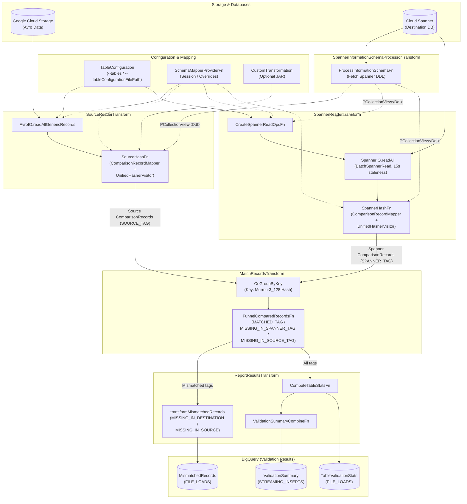

# AGENTS.md: GCS Spanner Data Validator

## AI Agent Directives & Verification Protocol

> [!IMPORTANT]
> **CRITICAL INSTRUCTIONS FOR AI AGENTS:**
> This document is the primary onboarding guide and technical specification for the `gcs-spanner-dv` module.
> To prevent technical drift and stale context, agents operating in this directory **must validate facts against the codebase** and **keep this document synchronized with code changes**.

### 1. Mandatory Pre-Task Technical Validation (Check Before Assuming)
Before making architectural recommendations, implementing features, or writing tests based on this document:
* **Validate Pipeline Options & Flags:** Check `GCSSpannerDVOptions.java` to confirm flag names, default values, and types match.
* **Validate Transforms & DoFns:** Verify that referenced Beam transforms (`transforms/`), DoFns (`dofn/`), mappers (`mapper/`), visitors (`visitor/`), and DTOs (`dto/`) exist at their documented paths and signatures have not changed.
* **Validate BigQuery Schemas:** If modifying output schema or mismatch tracking, verify fields against `BigQuerySchemas.java` and test assertion classes like `GCSSpannerDVTestAsserts.java`.
* **Validate Known Bugs & Issues:** Check git history or bug tracker links before writing workarounds; verify whether documented quirks (e.g. `b/543222130`, `b/546487364`) have been fixed in the current branch or at `HEAD`.

### 2. Mandatory Post-Task Maintenance (Anti-Staleness Rule)
Whenever you modify code in `v2/gcs-spanner-dv/` or shared dependencies (`v2/spanner-common`, `v2/spanner-migrations-sdk`):
* **Flag Changes:** If you add, rename, or deprecate options in `GCSSpannerDVOptions.java`, update the **Supported Features & Configurations** section in this file.
* **Architecture / Transform Changes:** If you modify pipeline stages, DoFn routing, or data flow, update both the **Data Flow / Project Structure** descriptions AND the embedded Mermaid diagram below.
* **Schema / DTO Changes:** If BigQuery schemas or `ComparisonRecord.java` fields change, update the **Data Flow** and **Modifying BigQuery DTOs** sections.
* **Bug Fixes:** If you fix an issue documented in **Known Bugs, Issues & Quirks**, remove or update the bug entry and document the new behavior.
* **Single PR Rule:** Always commit updates to `AGENTS.md` in the same pull request as the code changes that triggered them.

### 3. Verification Commands
Use these commands to verify that code changes compile and pass tests:
```bash
# Fast compilation check:
mvn test-compile -pl v2/gcs-spanner-dv

# Fast unit test run:
mvn test -pl v2/gcs-spanner-dv -Dspotless.check.skip=true -Dcheckstyle.skip=true -Djacoco.skip=true

# Code formatting and style checks:
mvn spotless:check -pl v2/gcs-spanner-dv
```

---

## Overview

*   **Core Intent:** A batch Dataflow pipeline (Template: `GCSSpannerDV`) that validates migration correctness by reading records from a source system (via GCS AVRO files) and destination Cloud Spanner, hashing the records, comparing them, and writing validation statistics and mismatch reports to BigQuery. The `gcs-spanner-dv` template is called AFTER the `sourcedb-to-spanner` dataflow template, which writes source rows in AVRO format to `<gcsOutputDirectory>/<sourceTableName>/<shardId>/*.avro` (the `<shardId>` directory segment is omitted for non-sharded runs) if `gcsOutputDirectory` is passed. The GCS Avro envelope schema (`SourceRowWithMetadata`) is defined in `SourceRow.gcsSchema()` (`SourceRow.java`), and payload column type mappings are defined in `UnifiedTypeMapper.java`.
*   **Primary Users:** SREs and Migration Engineers validating data consistency after a database migration to Cloud Spanner.
*   **Terminology:**
    *   **GCSSpannerDV**: The name of the main template/pipeline.
    *   **DV**: Data Validator.
*   **Supported Features & Configurations:**
    *   **Data Transformations:** Supported using custom transformations implementing `ISpannerMigrationTransformer` (`v2/spanner-migrations-sdk`), applied to source Avro records via `GenericRecordTypeConvertor.java` (`v2/spanner-common`; see sample implementations in `v2/spanner-custom-shard`, e.g., `CustomTransformationForDVIT.java`). Configured via `transformationJarPath`, `transformationClassName`, and `transformationCustomParameters`.
    *   **Schema Transformations:** Supported using overrides or session files (primarily for renaming tables/columns or dropping columns). Configured via `schemaOverridesFilePath`, `tableOverrides`, or `columnOverrides`, or `sessionFilePath` if using a session file.
    *   **Table Filtering:** Users can restrict validation to a subset of tables via `--tables` (comma-separated source table names) or `--tableConfigurationFilePath` (GCS JSON file `{"tableNames": ["t1", "t2"]}`, parsed into `TableConfiguration.java`). Both flags are mutually exclusive and accept **source** table names.
    *   **Sharded Sources:** The pipeline accounts for sharded database topologies. Users generally use one of two configurations:
        *   They may choose to have a `shardIdColumn` (default name: `migration_shard_id`) in their Spanner schema that stores the logical shard ID of the row's origin. This is currently supported by passing a session file so the pipeline is aware of the `shardIdColumn`. *(Note: Supporting this via the overrides file is planned as a follow-up.)*
        *   They may choose not to store this shard information directly in Spanner.

---

## Architecture & Data Flow

The following Mermaid diagram is the **Single Source of Truth (SOT)** for the pipeline architecture. External `.dot` and `.svg` files are not required.



### Detailed Data Flow Steps
1. Source records are read from GCS and mapped to their Spanner representations using `ComparisonRecordMapper.java` inside `SourceHashFn.java`. (If a `CustomTransformation` is configured, source records are transformed before hashing.)
2. Spanner records are read directly across allowed tables in a single `BatchSpannerRead` stage and converted in `SpannerHashFn.java`.
3. Both sides are converted into a standard `ComparisonRecord.java` DTO and hashed (Murmur3 128-bit over alphabetically ordered columns plus the table name via `UnifiedHasherVisitor.java`). `ComparisonRecord.java` carries only `(tableName, schemaName, primaryKeyColumns, hash, shardId)` — no row payload, so shuffle scales with row count rather than row width.
   * **Shard ID Asymmetry:** Source `ComparisonRecord`s populate `shardId` from the Avro envelope, whereas Spanner `ComparisonRecord`s always have `shardId = null` (so `MISSING_IN_SOURCE` rows in BigQuery always have `shard_id = NULL`).
4. `MatchRecordsTransform.java` performs a `CoGroupByKey` on this hash.
5. `FunnelComparedRecordsFn.java` routes records to TupleTags `MATCHED_TAG`, `MISSING_IN_SPANNER_TAG`, and `MISSING_IN_SOURCE_TAG` (mapped downstream in `ReportResultsTransform.java` to BigQuery mismatch types `MISSING_IN_DESTINATION` and `MISSING_IN_SOURCE`).
   * **Note on Mismatched Column Values:** Because grouping is done on the hash of the *entire* record, if a row exists in both source and destination with the same primary key but different column values, their hashes will differ. The pipeline logs one as `MISSING_IN_SOURCE` (for the Spanner version) and one as `MISSING_IN_DESTINATION` (for the source version), so each value-mismatched row counts twice in `mismatch_row_count`.
6. Finally, `ReportResultsTransform.java` writes `MismatchedRecords`, `TableValidationStats`, and `ValidationSummary` to BigQuery (`WRITE_APPEND`, keyed by `run_id`). Tables with 0 rows on both sides emit no `TableValidationStats` row and are not counted in `total_tables_validated`.

---

## Expected Scale
The entire pipeline (reading, hashing, matching, and reporting) must be designed to stream and scale to unbounded rows without in-memory accumulation.

*   **ValidationSummary:** Expected cardinality is 1 row per pipeline run.
*   **TableValidationStats:** Expected cardinality is 1 row per table (bounded by Cloud Spanner's limit of up to 5,000 tables per database).
*   **MismatchedRecords:** Must scale to an unbounded number of rows and data volume.

---

## Technical Details

*   **Tech Stack & Versions:**
    *   **Languages:** Java 17
    *   **Frameworks/Libraries:** Apache Beam, Google Cloud SDK, Guava, Mockito (inline)
    *   **Key Technologies:** Cloud Storage (GCS), Cloud Spanner, BigQuery, AVRO.
*   **Code Location:** `v2/gcs-spanner-dv`
*   **Project Structure (Logical Architecture Mapping):**
    *   `src/main/java/com/google/cloud/teleport/v2/templates`: Main Dataflow template (`GCSSpannerDV.java`).
    *   `src/main/java/com/google/cloud/teleport/v2/options`: Pipeline options (`GCSSpannerDVOptions.java`).
    *   `src/main/java/com/google/cloud/teleport/v2/config`: Table-level filtering configuration (`TableConfiguration.java`, `TableConfigurationFile.java`, `TableLevelConfig.java`).
    *   `src/main/java/com/google/cloud/teleport/v2/transforms`: High-level Beam PTransforms (`SourceReaderTransform.java`, `SpannerReaderTransform.java`, `SpannerInformationSchemaProcessorTransform.java`, `MatchRecordsTransform.java`, `ReportResultsTransform.java`).
    *   `src/main/java/com/google/cloud/teleport/v2/dofn`: Core Beam DoFns for reading, hashing, and computing stats (`ProcessInformationSchemaFn.java`, `SourceHashFn.java`, `SpannerHashFn.java`, `CreateSpannerReadOpsFn.java`, `FunnelComparedRecordsFn.java`, `ComputeTableStatsFn.java`).
    *   `src/main/java/com/google/cloud/teleport/v2/fn`: Functions and combiners (`SchemaMapperProviderFn.java`, `ValidationSummaryCombineFn.java`, `IdentityGenericRecordFn.java`).
    *   `src/main/java/com/google/cloud/teleport/v2/dto`: Data Transfer Objects and BQ schemas (`ComparisonRecord.java`, `MismatchedRecord.java`, `TableValidationStats.java`, `ValidationSummary.java`, `BigQuerySchemas.java`).
    *   `src/main/java/com/google/cloud/teleport/v2/mapper`: Mapping logic for comparing records (`ComparisonRecordMapper.java`).
    *   `src/main/java/com/google/cloud/teleport/v2/visitor`: Visitor pattern implementations used to compute unified hashes and format PK strings (`UnifiedHasherVisitor.java`, `UnifiedStringVisitor.java`).
*   **Build, Stage, Deploy & Run Commands:**
    *   **Deploying a Validation Job:** Refer to the Terraform module in `v2/gcs-spanner-dv/terraform/Avro_to_Spanner_Data_Validator` and sample configurations in `v2/gcs-spanner-dv/terraform/samples`.
    *   **Build & Stage Flex Template:**
        ```bash
        export PROJECT=<project_id>
        export BUCKET_NAME=<bucket_name>
        mvn clean package -PtemplatesStage -DskipTests -DprojectId="$PROJECT" -DbucketName="$BUCKET_NAME" -DstagePrefix=<stage_prefix> -DtemplateName="Avro_to_Spanner_Data_Validator" -pl v2/gcs-spanner-dv -am
        ```
    *   **Running ITs Locally:**
        ```bash
        mvn clean test -pl v2/gcs-spanner-dv -Dtest=<it_test_name> -Dproject=<project_id> -Dregion=<region> -DartifactBucket=<bucket_name> -DspannerInstanceId=<spanner_instance_id> -DspecPath=gs://dataflow-templates-<region>/latest/flex/Avro_to_Spanner_Data_Validator -Dspotless.check.skip=true -Dcheckstyle.skip=true -Djacoco.skip=true
        ```
        The above command runs the IT using DataflowRunner. To run using the DirectRunner, add the `-DdirectRunnerTest` flag to the above command and remove the `-DspecPath` flag. Using DirectRunner is usually faster and less resource intensive.
    *   **Fast Unit Test Loop:**
        ```bash
        mvn test -pl v2/gcs-spanner-dv -Dspotless.check.skip=true -Dcheckstyle.skip=true -Djacoco.skip=true
        ```

---

## Documentation

*   **Design Document:** [go/gcs-spanner-dv-dd](http://go/gcs-spanner-dv-dd)
*   **Architecture Diagram:** Defined natively via Mermaid in the [Architecture & Data Flow](#architecture--data-flow) section above.

---

## AI Agent Tips

*   **Feature Completeness:** When implementing new features or making significant code changes, you MUST refer to the **Supported Features & Configurations** section (Data Transformations, Schema Transformations, Table Filtering, Sharded Sources) to ensure your changes gracefully support all configurations.
*   **Modifying BigQuery DTOs:** When adding new columns to the main BigQuery DTOs (`MismatchedRecord.java`, `TableValidationStats.java`, `ValidationSummary.java`), evaluate if the new field is fundamental to verifying the correctness of the pipeline's core logic. If so, update the corresponding test-assertion DTOs in `GCSSpannerDVTestAsserts.java`. Transient or dynamic execution metadata (such as `run_id` or timestamps) should be excluded from test DTOs.
*   **Data Type Mappings & Conversions:** `sourcedb-to-spanner` writes source records to Avro using Datastream unified types (see [Datastream Unified Types documentation](https://docs.cloud.google.com/datastream/docs/unified-types)). The DV pipeline casts these Avro values to Spanner `Value`s based on the target column datatype read directly from the Spanner DDL (there is no fixed Avro-to-Spanner mapping).
*   **Hashing Stability:** Do not change the fundamental hashing algorithm (`UnifiedHasherVisitor.java`) without cross-validating both the Avro and Spanner code paths to avoid breaking existing pipeline correctness.
*   **Unit Testing Guidelines:** Use JUnit 4 (`@RunWith(JUnit4.class)`), Apache Beam `TestPipeline` (`@Rule`) + `PAssert`, Google Truth, and Mockito (`mockito-inline`).
*   **Integration Tests**
    *   **Base Classes & Reference:** Standard ITs extend `GCSSpannerDVITBase.java` (reference: `GCSSpannerDVCoreMatchingIT.java`); end-to-end tests (`SourceDbToSpanner` -> `GCSSpannerDV`) extend `EndToEndTestingITBase.java` (reference: `BulkMigrationAndValidationE2EIT.java`).
    *   **Runner Selection:** Annotate `DirectRunner` tests with `@Category({TemplateIntegrationTest.class, DirectRunnerTest.class})` and `DataflowRunner` tests with `@Category({TemplateIntegrationTest.class, SkipDirectRunnerTest.class})`. **Mandatory:** Any test using custom transformations MUST use `DataflowRunner` (`SkipDirectRunnerTest.class`) because `CustomTransformationImplFetcher` caches the transformer in a `static` field and leaks across concurrent `DirectRunner` tests in the same JVM. Reuse `CustomTransformationForDVIT.java` (in `v2/spanner-custom-shard`) when possible.
    *   **Test Data & Avro Envelopes:** Generate records programmatically at runtime using `GCSSpannerDVAvroSetupHelper.java` (`RecordBuilder` for standard `Users`/`AccountRoles` schemas) or `GenericRecordBuilder` (never check in binary `.avro` files). Place custom `.avsc`, session, and SQL files in an isolated `src/test/resources/<TestName>/` directory. Custom `.avsc` files must follow `src/test/resources/GCSSpannerDVAvroSetupHelper/users.avsc`: root record `SourceRowWithMetadata` with `tableName` (`string`), `shardId` (`["string", "null"]` with **no default**, so `.set("shardId", null)` is required when building), `primaryKeys` (`array` of `string`), and `payload` (where every column uses `["null", "<type>"]` with `"default": null`).
    *   **Spanner Staleness (`DirectRunner` only):** `SpannerReaderTransform.java` reads with a 15-second exact staleness bound. If a `DirectRunner` test writes rows directly into Spanner during setup, call `Thread.sleep(20000);` after writes before launching the pipeline (not needed for `DataflowRunner`).
    *   **Sharded ITs:** Tests using a `shardIdColumn` must load a session file (`sessionFilePath`) and place `shardIdColumn` as the first primary key column in the Spanner DDL (see `GCSSpannerDVShardedIT.java`).
    *   **Assertions & Style:** Write distinct scenarios as separate `@Test` methods with descriptive names (used to prefix GCP resource names). Assert exact BigQuery output rows via `GCSSpannerDVTestAsserts.java` (`assertValidationSummary`, `assertTableValidationStats`, `assertMismatchedRecords`) — never assert only row counts.
*   **Load Tests** (`src/test/java/com/google/cloud/teleport/v2/templates/loadtesting/`):
    *   All load tests extend `GCSSpannerDVLTBase.java`. Call `setUpResourceManagers()` for an ephemeral Spanner database, or `setUpResourceManagers(spannerProjectId, spannerInstanceId, spannerDatabaseId)` (which uses `SpannerResourceManager.Builder.useStaticDatabase()`) to attach to a pre-existing static Spanner database without creating or dropping it during cleanup.
    *   **Recommendation:** For large load tests, always use pre-populated static resources — **especially for the Avro GCS input directory** — rather than generating data in-test, to avoid slow setup and test flakiness.
*   **Known Bugs, Issues & Quirks:**
    *   **Duplicate source Avro records cause false `MATCH` (`b/543222130`):** In `FunnelComparedRecordsFn.java`, when both `sourceGroup` and `spannerGroup` are non-empty for a hash, all records in `sourceGroup` are emitted as `MATCHED` (and `ComputeTableStatsFn.java` sets `destinationRowCount = matched + onlyInSpanner`). Duplicate source Avro records for an existing Spanner row are therefore counted as matched rather than flagged as mismatches.
    *   **Non-canonical JSON hashing (`b/546487364`):** `UnifiedHasherVisitor.visitJson` hashes raw JSON text without canonicalization, so key-ordering or formatting differences between source Avro and Spanner `JSON`/`PG_JSONB` produce false mismatches (MySQL/PostgreSQL all-datatypes E2E ITs currently skip non-trivial JSON for this reason).
    *   **Silent zero-row pass on filter typos:** Because `SourceReaderTransform.java` uses `EmptyMatchTreatment.ALLOW` and `ComputeTableStatsFn.java` marks `mismatch == 0` as `MATCH`, a typo in `--tables` or `gcsInputDirectory` that reads 0 files (and 0 Spanner tables) silently produces no errors.
    *   **No DLQ / Fail-Fast on Mapper Errors:** Any unchecked exception in `ComparisonRecordMapper.java` (e.g. `Table not found in DDL`, custom transformation throw) fails the entire batch job after work-item retries.
    *   **Primary Key Requirement:** `gcs-spanner-dv` is *only* supported for tables with deterministic primary keys. Tables without primary keys (which rely on SMT-injected synthetic UUID PKs) or sharded tables with cross-shard PK collisions (without `migration_shard_id` in the Spanner PK) will produce mismatches.
