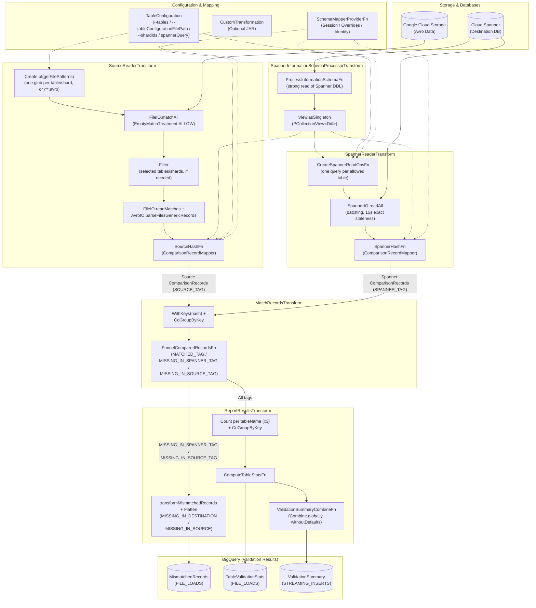

# AGENTS.md: GCS Spanner Data Validator

> [!IMPORTANT]
> **For AI agents:** The code is the source of truth. If this document conflicts with the code, follow the code and fix this document. If your change adds or alters a user-facing feature, pipeline stage, BigQuery schema, or known bug, update the matching section (and the Mermaid diagram) in the same change.

## Commands

```bash
# Setup — run once, and again after pulling or changing an upstream module (spanner-common, spanner-migrations-sdk, it, ...).
# Installs upstream jars into ~/.m2 and builds v2/spanner-custom-shard/target/*.jar, which ITs/LTs upload for custom transformations:
mvn install -pl v2/gcs-spanner-dv,v2/spanner-custom-shard -am -DskipTests -Djib.skip

# Compile (-am also compiles upstream modules such as spanner-common):
mvn test-compile -pl v2/gcs-spanner-dv -am

# Unit tests:
mvn test -pl v2/gcs-spanner-dv -Dspotless.check.skip=true -Dcheckstyle.skip=true -Djacoco.skip=true

# Formatting / style:
mvn spotless:check -pl v2/gcs-spanner-dv

# Integration test (DataflowRunner tests stage the template from local source into -DstageBucket):
mvn clean test -pl v2/gcs-spanner-dv -Dtest=<it_test_name> -Dproject=<project_id> -Dregion=<region> -DartifactBucket=<bucket_name> -DstageBucket=<bucket_name> -DspannerInstanceId=<spanner_instance_id> -Dspotless.check.skip=true -Dcheckstyle.skip=true -Djacoco.skip=true

# Build & stage the Flex Template:
mvn clean package -PtemplatesStage -DskipTests -DprojectId=<project_id> -DbucketName=<bucket_name> -DstagePrefix=<stage_prefix> -DtemplateName="Avro_to_Spanner_Data_Validator" -pl v2/gcs-spanner-dv -am

# Load test:
mvn verify -PtemplatesLoadTests -pl v2/gcs-spanner-dv -Dtest=<lt_test_name> -Dproject=cloud-teleport-testing -Dregion=us-central1 -DartifactBucket=<bucket_name> -DstageBucket=<bucket_name> -DspecPath=<staged_template_spec_path> -DexportProject=<project_id> -DexportDataset=<dataset> -DexportTable=<table> -Dspotless.check.skip=true -Dcheckstyle.skip=true -Djacoco.skip=true
```

*   **Runner selection:** The test's category decides the runner: tests tagged `DirectRunnerTest` always run on DirectRunner; all others run on DataflowRunner. To iterate quickly on a DataflowRunner test, run just that test method locally with `-DdirectRunnerTest` (except tests using custom transformations, which must not run on DirectRunner).
*   **`-DspecPath`:** For ITs, do not pass `-DspecPath=gs://dataflow-templates-<region>/latest/...` to validate a change — it runs the *released* template, not your code. Load tests are the opposite: without `-DspecPath`, `GCSSpannerDVLTBase` falls back to the released template, so to test a change, point it at a template you staged.
*   **Deployment:** Terraform module in `terraform/Avro_to_Spanner_Data_Validator`, samples in `terraform/samples`.

---

## Overview

*   **Core Intent:** A batch Dataflow pipeline (class `GCSSpannerDV`, template `Avro_to_Spanner_Data_Validator`) that validates migration correctness by reading records from a source system (via GCS AVRO files) and destination Cloud Spanner, hashing the records, comparing them, and writing validation statistics and mismatch reports to BigQuery. The `gcs-spanner-dv` template is called AFTER the `sourcedb-to-spanner` dataflow template, which writes source rows in AVRO format to `<gcsOutputDirectory>/<sourceTableName>/<shardId>/*.avro` (the `<shardId>` directory segment is omitted for non-sharded runs) if `gcsOutputDirectory` is passed. The GCS Avro envelope schema (`SourceRowWithMetadata`) is defined in `SourceRow.gcsSchema()` (`SourceRow.java`), and payload column type mappings are defined in `UnifiedTypeMapper.java`.
*   **Supported Features & Configurations:**
    *   **Data Transformations:** Supported using custom transformations implementing `ISpannerMigrationTransformer` (`v2/spanner-migrations-sdk`), applied to source Avro records via `GenericRecordTypeConvertor.java` (`v2/spanner-common`; see sample implementations in `v2/spanner-custom-shard`, e.g., `CustomTransformationForDVIT.java`). Configured via `transformationJarPath`, `transformationClassName`, and `transformationCustomParameters`.
    *   **Schema Transformations:** Supported using overrides or session files (primarily for renaming tables/columns or dropping columns). Configured via `schemaOverridesFilePath`, `tableOverrides`, or `columnOverrides`, or `sessionFilePath` if using a session file. Only one mapper is used, with precedence `sessionFilePath` > `schemaOverridesFilePath` > `tableOverrides`/`columnOverrides` > identity (`SchemaMapperProviderFn.java`); lower-priority inputs are silently ignored.
    *   **Table Filtering:** Users can restrict validation to a subset of tables via `--tables` (comma-separated source table names) or `--tableConfigurationFilePath` (GCS JSON file `{"tableNames": ["t1", "t2"]}`, parsed into `TableConfiguration.java`). Both flags are mutually exclusive and accept **source** table names; a Spanner-only table (no source table) is named by its Spanner name.
    *   **Shard Subsetting:** Users can restrict validation to selected logical shards (the `<shardId>` directories in GCS) via `--shardIds`, combined with table filtering as an intersection. On the Spanner side, every in-scope table must be narrowed either by a session-file `shardIdColumn` or by a user-written `spannerQuery` in `tableConfigurationFilePath` (`optionalConfigurations.<table>.spannerQuery`, which wins if both exist).
    *   **Sharded Sources:** The pipeline accounts for sharded database topologies. Users generally use one of these configurations:
        *   They may choose to have a `shardIdColumn` (default name: `migration_shard_id`) in their Spanner schema that stores the logical shard ID of the row's origin. This is currently supported by passing a session file so the pipeline is aware of the `shardIdColumn`. *(Note: Supporting this via the overrides file is planned as a follow-up.)*
        *   They may combine schema overrides with a custom transformation that returns the `shardIdColumn` value. Hashing works, but this is **not recommended** because shard ID column support for overrides is incomplete: the overrides mappers return `null` from `getShardIdColumnName`, so the pipeline itself is unaware of the column.
        *   They may choose not to store this shard information directly in Spanner.

---

## Architecture & Data Flow

The following Mermaid diagram is the **Single Source of Truth (SOT)** for the pipeline architecture. External `.dot` and `.svg` files are not required.



### Detailed Data Flow Steps
1. Source Avro files under `gcsInputDirectory` are matched using glob patterns from `SourceReaderTransform.getFilePatterns` (narrowed to the selected tables and shards when a filter is set), read, and mapped to their Spanner representations using `ComparisonRecordMapper.java` inside `SourceHashFn.java`. (If a `CustomTransformation` is configured, source records are transformed before hashing.)
2. `CreateSpannerReadOpsFn.java` emits one query per allowed Spanner table (narrowed to the selected shards when `--shardIds` is set), and a single `SpannerIO.readAll` stage (batching, 15s exact staleness) reads them all. Rows are converted in `SpannerHashFn.java`.
3. Both sides are converted into a standard `ComparisonRecord.java` DTO and hashed in `ComparisonRecordMapper.buildRecord`: a Murmur3 128-bit hasher over alphabetically ordered column names and values (values are fed type-aware by `UnifiedHasherVisitor.java`), followed by the table name. `ComparisonRecord.java` carries only `(tableName, schemaName, primaryKeyColumns, hash, shardId)` — no row payload, so shuffle scales with row count rather than row width.
   * **Shard ID Asymmetry:** Source `ComparisonRecord`s populate `shardId` from the Avro envelope, whereas Spanner `ComparisonRecord`s always have `shardId = null` (so `MISSING_IN_SOURCE` rows in BigQuery always have `shard_id = NULL`).
4. `MatchRecordsTransform.java` performs a `CoGroupByKey` on this hash.
5. `FunnelComparedRecordsFn.java` routes records to TupleTags `MATCHED_TAG`, `MISSING_IN_SPANNER_TAG`, and `MISSING_IN_SOURCE_TAG` (mapped downstream in `ReportResultsTransform.java` to BigQuery mismatch types `MISSING_IN_DESTINATION` and `MISSING_IN_SOURCE`).
   * **Note on Mismatched Column Values:** Because grouping is done on the hash of the *entire* record, if a row exists in both source and destination with the same primary key but different column values, their hashes will differ. The pipeline logs one as `MISSING_IN_SOURCE` (for the Spanner version) and one as `MISSING_IN_DESTINATION` (for the source version), so each value-mismatched row counts twice in `mismatch_row_count`.
6. Finally, `ReportResultsTransform.java` writes `MismatchedRecords`, `TableValidationStats`, and `ValidationSummary` to BigQuery (`WRITE_APPEND`, keyed by `run_id`). Tables with 0 rows on both sides emit no `TableValidationStats` row and are not counted in `total_tables_validated`.

---

## Expected Scale
The entire pipeline (reading, hashing, matching, and reporting) must be designed to stream and scale to unbounded rows without in-memory accumulation.

*   **ValidationSummary:** Expected cardinality is at most 1 row per pipeline run (0 rows if no table produced stats).
*   **TableValidationStats:** Expected cardinality is at most 1 row per table; tables with no rows on either side get no row (bounded by Cloud Spanner's limit of up to 5,000 tables per database).
*   **MismatchedRecords:** Must scale to an unbounded number of rows and data volume.

---

## Code Layout (`src/main/java/com/google/cloud/teleport/v2/`)

*   `templates`: pipeline entry point. `options`: pipeline options (`GCSSpannerDVOptions.java`). `config`: table and shard filtering, and per-table options.
*   `transforms`: top-level PTransforms (one per stage in the diagram). `dofn`: DoFns for reading, hashing, matching, and stats. `fn`: schema mapper provider, summary combiner, and helpers.
*   `dto`: `ComparisonRecord`, BigQuery row DTOs, and `BigQuerySchemas.java`. `mapper`: `ComparisonRecordMapper` (Avro/Spanner → `ComparisonRecord`). `visitor`: type-aware hashing and PK string formatting.

Design doc: [go/gcs-spanner-dv-dd](http://go/gcs-spanner-dv-dd)

---

## AI Agent Tips

*   **Feature Completeness:** When implementing new features or making significant code changes, you MUST refer to the **Supported Features & Configurations** section (Data Transformations, Schema Transformations, Table Filtering, Shard Subsetting, Sharded Sources) to ensure your changes gracefully support all configurations.
*   **Adding per-table options:** Add fields to `TableLevelConfig` (the `optionalConfigurations.<table>` value) and keep `TableConfiguration` holding the whole `Map<String, TableLevelConfig>` rather than one map per field.
*   **Modifying BigQuery DTOs:**
    *   Evaluate if the new field is fundamental to verifying the correctness of the pipeline's core logic. If so, update the corresponding test-assertion DTOs in `GCSSpannerDVTestAsserts.java`. Transient or dynamic execution metadata (such as `run_id` or timestamps) should be excluded from test DTOs.
*   **Data Type Mappings & Conversions:** `sourcedb-to-spanner` writes source records to Avro using Datastream unified types (see [Datastream Unified Types documentation](https://docs.cloud.google.com/datastream/docs/unified-types)). The DV pipeline casts these Avro values to Spanner `Value`s based on the target column datatype read directly from the Spanner DDL (there is no fixed Avro-to-Spanner mapping).
*   **Hashing Stability:** Do not change the hashing algorithm (`ComparisonRecordMapper.buildRecord` and `UnifiedHasherVisitor.java`) without cross-validating both the Avro and Spanner code paths to avoid breaking existing pipeline correctness.
*   **Unit Testing Guidelines:** Use JUnit 4 (`@RunWith(JUnit4.class)`), Apache Beam `TestPipeline` (`@Rule`) + `PAssert`, Google Truth, and Mockito (`mockito-inline`).
*   **Integration Tests**
    *   **Base Classes & Reference:** Standard ITs extend `GCSSpannerDVITBase.java` (reference: `GCSSpannerDVCoreMatchingIT.java`); end-to-end tests (`SourceDbToSpanner` -> `GCSSpannerDV`) extend `EndToEndTestingITBase.java` (reference: `BulkMigrationAndValidationE2EIT.java`).
    *   **Runner Selection:** Tag `DirectRunner` tests with `@Category({TemplateIntegrationTest.class, DirectRunnerTest.class})`; tests tagged only `TemplateIntegrationTest` run on `DataflowRunner`. **Mandatory:** Tests using custom transformations must NOT be tagged `DirectRunnerTest` because `CustomTransformationImplFetcher` (`v2/spanner-common`, `.../spanner/migrations/utils/`) caches the first transformer it loads in a `static` field that is never reset. DV always passes a `CustomTransformation` to the fetcher, so once a transformer is cached it leaks into every later pipeline in the same JVM (sequential or concurrent). Reuse `CustomTransformationForDVIT.java` (in `v2/spanner-custom-shard`) when possible.
    *   **Test Data & Avro Envelopes:** Generate records programmatically at runtime using `GCSSpannerDVAvroSetupHelper.java` (`RecordBuilder` for standard `Users`/`AccountRoles` schemas) or `GenericRecordBuilder` (never check in binary `.avro` files). Wherever possible, try to re-use the `Users`/`AccountRoles` schemas from `GCSSpannerDVAvroSetupHelper`. Place custom `.avsc`, session, and SQL files in an isolated `src/test/resources/<TestName>/` directory. Custom `.avsc` files must follow `src/test/resources/GCSSpannerDVAvroSetupHelper/users.avsc`: root record `SourceRowWithMetadata` with `tableName` (`string`), `shardId` (`["string", "null"]` with **no default**, so `.set("shardId", null)` is required when building), `primaryKeys` (`array` of `string`), and `payload` (where every column uses `["null", "<type>"]` with `"default": null`).
    *   **Spanner Staleness (`DirectRunner` only):** `SpannerReaderTransform.java` reads with a 15-second exact staleness bound. If a `DirectRunner` test creates tables or writes rows in Spanner during setup, call `Thread.sleep(20000);` after the last Spanner DDL or write, before launching the pipeline (not needed for `DataflowRunner`).
    *   **Sharded ITs:** Tests using a `shardIdColumn` must load a session file (`sessionFilePath`) and place `shardIdColumn` as the first primary key column in the Spanner DDL (see `GCSSpannerDVShardedIT.java`).
    *   **Shard Subsetting ITs:** Upload Avro to `input/<Table>/<shardId>/` (not flat) so shard and table filtering apply (see `GCSSpannerDVSubsetShardIT.java`).
    *   **Spanner Limits (`GCSSpannerDVWideRowMax*IT.java`):** These ITs cover Spanner limits (max columns, cell size, key size, key columns, name lengths, string size). Changes to type handling, hashing, PK formatting, or read/shuffle paths must keep them passing.
    *   **New Source Dialects:** When adding support for a new source database that needs an all-datatypes E2E IT (like `BulkMigrationAndValidationMySQLAllDataTypesE2EIT.java`), use the `add-integ-tests-gcs-spanner-dv` skill (`v2/gcs-spanner-dv/.agents/skills/`). It delegates to `add-source-datatype-integ-test` (`v2/spanner-common/.agents/skills/`) and requires a datatype mapping matrix file.
    *   **Assertions & Style:** Write distinct scenarios as separate `@Test` methods with descriptive names (used to prefix GCP resource names). Assert exact BigQuery output rows via `GCSSpannerDVTestAsserts.java` (`assertValidationSummary`, `assertTableValidationStats`, `assertMismatchedRecords`) — never assert only row counts.
*   **Load Tests** (`src/test/java/com/google/cloud/teleport/v2/templates/loadtesting/`):
    *   All load tests extend `GCSSpannerDVLTBase.java`. Call `setUpResourceManagers()` for an ephemeral Spanner database, or `setUpResourceManagers(spannerProjectId, spannerInstanceId, spannerDatabaseId)` (which uses `SpannerResourceManager.Builder.useStaticDatabase()`) to attach to a pre-existing static Spanner database without creating or dropping it during cleanup.
    *   **Recommendation:** For large load tests, always use pre-populated static resources — **especially for the Avro GCS input directory** — rather than generating data in-test, to avoid slow setup and test flakiness.
    *   **Static resources are read-only:** Cleanup never drops a static database, and other load tests assert on its exact contents. Never run DDL or DML against static Spanner databases or write to static GCS inputs. Existing static resources live in project `cloud-teleport-testing` (Spanner instance `teleport-avro-to-spanner-dv`, bucket `gs://nokill-avro-to-spanner-dv/`); see the constants in each load test.
    *   **Assertions at scale:** Prefer asserting exact BigQuery rows, as in ITs. When the output is too large to read row by row (typically `MismatchedRecords`), asserting counts is fine; use `GCSSpannerDVTestAsserts.countMismatchedRecords`.
*   **Known Bugs, Issues & Quirks:**
    *   **Duplicate source Avro records cause false `MATCH` (`b/543222130`):** In `FunnelComparedRecordsFn.java`, when both `sourceGroup` and `spannerGroup` are non-empty for a hash, all records in `sourceGroup` are emitted as `MATCHED` (and `ComputeTableStatsFn.java` sets `destinationRowCount = matched + onlyInSpanner`). Duplicate source Avro records for an existing Spanner row are therefore counted as matched rather than flagged as mismatches.
    *   **Non-canonical JSON hashing (`b/546487364`):** `UnifiedHasherVisitor.visitJson` hashes raw JSON text without canonicalization, so key-ordering or formatting differences between source Avro and Spanner `JSON`/`PG_JSONB` produce false mismatches (MySQL/PostgreSQL all-datatypes E2E ITs currently skip non-trivial JSON for this reason).
    *   **Unmatched filters are silently ignored:** A table (`--tables` / `tableConfigurationFilePath`) or shard ID (`--shardIds`) that matches nothing in GCS or Spanner is dropped without an error. It is absent from all BigQuery output (no `TableValidationStats` or `MismatchedRecords` rows, not counted in `ValidationSummary`), so a typo can let the run report `MATCH` without validating anything for it.
    *   **No DLQ / Fail-Fast on Mapper Errors:** Any unchecked exception in `ComparisonRecordMapper.java` (e.g. `Table not found in DDL`, custom transformation throw) fails the entire batch job after work-item retries.
    *   **BigQuery sinks are independent:** `MismatchedRecords`, `TableValidationStats`, and `ValidationSummary` are separate writes, and the summary is computed from table stats rather than gated on the other loads. A `ValidationSummary` row does not prove `MismatchedRecords` loaded successfully.
    *   **Named schemas are untested:** `sourcedb-to-spanner` does not support custom namespaces, so DV has never been tested with named schemas; treat them as unsupported (e.g., `TableValidationStats` is keyed by table name alone and `schema_name` is always `NULL`).
    *   **Primary Key Requirement:** `gcs-spanner-dv` is *only* supported for tables with deterministic primary keys. Tables without primary keys (which rely on SMT-injected synthetic UUID PKs) or sharded tables with cross-shard PK collisions (without `migration_shard_id` in the Spanner PK) will produce mismatches.
