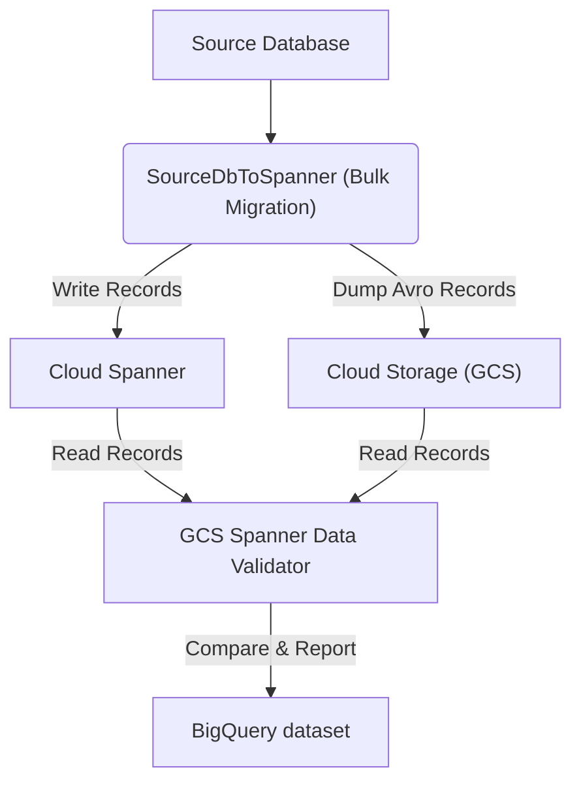

# GCS Spanner Data Validator - Usage Guide

This guide walks you through how to use the GCS Spanner Data Validator tool to validate your data after a bulk migration.

## Architecture

The following diagram illustrates the workflow: export data using bulk migration, and then validate it using this template.



## How to Use

### Step 1: Dump the Avro records to GCS

When performing the bulk migration from your source database to Cloud Spanner using the `SourceDbToSpanner` template, you can enable dumping of the records read from source to GCS. This ensures that you have the same data that was written to Spanner via bulk as a point-in-time snapshot that validations can run against reliably, and if needed, repeatably.

To enable this, set the `gcsOutputDirectory` parameter when running the `SourceDbToSpanner` job. This corresponds to `getGcsOutputDirectory` in `SourceDbToSpannerOptions.java`.

Example snippet for `SourceDbToSpanner` execution:
```shell
--parameters "gcsOutputDirectory=gs://your-bucket/your-path"
```

### Step 2: Configure and Run the Validation Template

After the records have been dumped to GCS, you can run the `GCS_Spanner_Data_Validator` template.

Refer to [README_GCS_Spanner_Data_Validator.md](README_GCS_Spanner_Data_Validator.md) for full details on all available parameters and commands to build and run the template.

The most important parameters you need to configure are:
- **gcsInputDirectory**: Path to the AVRO files dump from Step 1 (e.g., `gs://your-bucket/your-path`).
- **instanceId**: Destination Cloud Spanner instance.
- **databaseId**: Destination Cloud Spanner database.
- **bigQueryDataset**: BigQuery dataset ID where validation results will be stored.

You can run the template using `gcloud`, Dataflow REST API, or via Terraform.

### Step 3: Observe the Dataflow Pipeline

Once the job is submitted, you can monitor its progress in the Dataflow console. The pipeline reads from both GCS and Spanner, computes deterministic hashes for the records, and compares them.

Key metrics to observe in the console (standard Beam metrics):
- **Elements Read from Source**: Number of records read from GCS.
- **Elements Read from Destination**: Number of records read from Spanner.
- **Mismatches**: Number of records that did not match between source and destination (written to BigQuery).

If the counts match and no mismatches are reported, your data is validated.

### Step 4: Verify Results in BigQuery

When the pipeline completes, results are written to BigQuery in the dataset specified by `bigQueryDataset`.

The results are distributed across three tables:
1.  **`MismatchedRecords`** (Captures specific records that failed validation):
    - Fields include `runId`, `tableName`, `mismatch_type` (`MISSING_IN_DESTINATION` or `MISSING_IN_SOURCE`), `record_key`, `source`, `hash`.
2.  **`TableValidationStats`** (Aggregates statistics for each validated table):
    - Fields include `run_id`, `table_name`, `status` (`MATCH` or `MISMATCH`), counts of rows (source, destination, matched, mismatched).
3.  **`ValidationSummary`** (A single-row summary across all tables):
    - Fields include `run_id`, totals of tables and rows, and final status.

#### Example Queries

Find top mismatches by table:
```sql
SELECT table_name, count(*) as count
FROM `your_project.your_dataset.MismatchedRecords`
WHERE runId = 'your_run_id'
GROUP BY table_name;
```

Check status of each table:
```sql
SELECT table_name, status, source_row_count, destination_row_count
FROM `your_project.your_dataset.TableValidationStats`
WHERE run_id = 'your_run_id';
```

## References
- See [README_GCS_Spanner_Data_Validator.md](README_GCS_Spanner_Data_Validator.md) for full commands to build and run the template.
