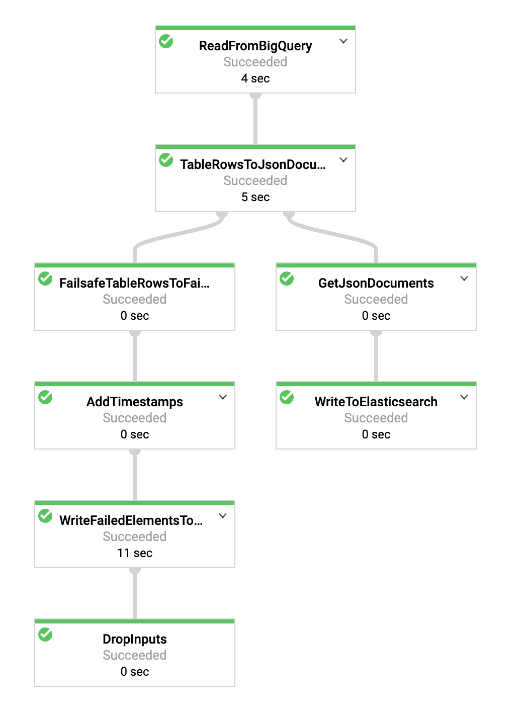

# BigQuery to Elasticsearch Dataflow Template

The [BigQueryToElasticsearch](../../src/main/java/com/google/cloud/teleport/v2/elasticsearch/templates/BigQueryToElasticsearch.java) pipeline ingests
data from a BigQuery table into Elasticsearch. The template can either read the entire table or read using a supplied query.

Pipeline flow is illustrated below:



## Getting Started

### Requirements
* Java 8
* Maven
* BigQuery table exists
* Elasticsearch Instance exists

### Building Template
This is a Flex Template meaning that the pipeline code will be containerized, and the container will be
run on Dataflow.

#### Building Container Image
* Set environment variables that will be used in the build process.
```sh
export PROJECT=<my-project>
export IMAGE_NAME=<my-image-name>
export BUCKET_NAME=gs://<bucket-name>
export TARGET_GCR_IMAGE=gcr.io/${PROJECT}/${IMAGE_NAME}
export BASE_CONTAINER_IMAGE=gcr.io/dataflow-templates-base/java8-template-launcher-base
export BASE_CONTAINER_IMAGE_VERSION=latest
export TEMPLATE_MODULE=bigquery-to-elasticsearch
export APP_ROOT=/template/googlecloud-to-elasticsearch
export COMMAND_SPEC=${APP_ROOT}/resources/${TEMPLATE_MODULE}-command-spec.json
export TEMPLATE_IMAGE_SPEC=${BUCKET_NAME}/images/${TEMPLATE_MODULE}-image-spec.json

export INPUT_TABLE_SPEC=<my-project:my-dataset.my-table>
export TARGET_NODE_ADDRESSES=<url-or-cloud_id>
export WRITE_DATASET=<write-dataset>
export WRITE_NAMESPACE=<write-namespace>
export WRITE_DOCUMENT_TYPE=<my-type>
export USE_LEGACY_SQL=false
export WRITE_ELASTICSEARCH_USERNAME=<write-username>
export WRITE_ELASTICSEARCH_PASSWORD=<write-password>

gcloud config set project ${PROJECT}
```
* Build and push image to Google Container Repository
```sh
mvn clean package \
    -Dimage=${TARGET_GCR_IMAGE} \
    -Dbase-container-image=${BASE_CONTAINER_IMAGE} \
    -Dbase-container-image.version=${BASE_CONTAINER_IMAGE_VERSION} \
    -Dapp-root=${APP_ROOT} \
    -Dcommand-spec=${COMMAND_SPEC} \
    -am -pl ${TEMPLATE_MODULE}
```

#### Creating Image Spec

Create file in Cloud Storage with path to container image in Google Container Repository.
```sh
echo '{
    "image":"'${TARGET_GCR_IMAGE}'",
    "metadata":{
      "name":"BigQuery to Elasticsearch",
      "description":"Replicates BigQuery data into an Elasticsearch index",
      "parameters":[
          {
              "name":"inputTableSpec",
              "label":"Table in BigQuery to read from",
              "helpText":"Table in BigQuery to read from in form of: my-project:my-dataset.my-table. Either this or query must be provided.",
              "paramType":"TEXT",
              "isOptional":false
          },
          {
              "name":"targetNodeAddresses",
              "label":"Comma separated list of Elasticsearch target nodes",
              "helpText":"Comma separated list of Elasticsearch target nodes to connect to, ex: http://my-node1,http://my-node2",
              "paramType":"TEXT",
              "isOptional":false
          },
          {
              "name":"writeDocumentType",
              "label":"The write document type",
              "helpText":"The write document type toward which the requests will be issued, ex: my-document-type",
              "paramType":"TEXT",
              "isOptional":false
          },
          {
              "name":"writeElasticsearchUsername",
              "label":"Write Elasticsearch username for elasticsearch endpoint",
              "helpText":"Write Elasticsearch username for elasticsearch endpoint",
              "paramType":"TEXT",
              "isOptional":false
          },
          {
              "name":"writeElasticsearchPassword",
              "label":"Write Elasticsearch password for elasticsearch endpoint",
              "helpText":"Write Elasticsearch password for elasticsearch endpoint",
              "paramType":"TEXT",
              "isOptional":false
          },
          {
              "name":"writeDataset",
              "label":"Write Dataset used to build index",
              "helpText":"Write Dataset used to build index in format: logs-gcp.{Dataset}-{Namespace}",
              "paramType":"TEXT",
              "isOptional":false
          },
          {
              "name":"writeNamespace",
              "label":"Write Namespace used to build index",
              "helpText":"Write Namespace used to build index in format: logs-gcp.{Dataset}-{Namespace}",
              "paramType":"TEXT",
              "isOptional":false
          },
          {
              "name":"useLegacySql",
              "label":"Set to true to use legacy SQL",
              "helpText":"Set to true to use legacy SQL (only applicable if supplying query). Default: false",
              "paramType":"TEXT",
              "isOptional":true
          },
          {
              "name":"query",
              "label":"Query to run against input table",
              "helpText":"Query to run against input table,.    * For Standard SQL  ex: 'SELECT max_temperature FROM \`clouddataflow-readonly.samples.weather_stations\`'.    * For Legacy SQL ex: 'SELECT max_temperature FROM [clouddataflow-readonly:samples.weather_stations]'",
              "paramType":"TEXT",
              "isOptional":true
          },
          {
              "name":"batchSize",
              "label":"Batch size in number of documents",
              "helpText":"Batch size in number of documents. Default: 1000",
              "paramType":"TEXT",
              "isOptional":true
          },
          {
              "name":"batchSizeBytes",
              "label":"Batch size in number of bytes",
              "helpText":"Batch size in number of bytes. Default: 5242880 (5mb)",
              "paramType":"TEXT",
              "isOptional":true
          },
          {
              "name":"maxRetryAttempts",
              "label":"Max retry attempts",
              "helpText":"Max retry attempts, must be > 0. Default: no retries",
              "paramType":"TEXT",
              "isOptional":true
          },
          {
              "name":"maxRetryDuration",
              "label":"Max retry duration in milliseconds",
              "helpText":"Max retry duration in milliseconds, must be > 0. Default: no retries",
              "paramType":"TEXT",
              "isOptional":true
          },
          {
              "name":"usePartialUpdates",
              "label":"Set to true to issue partial updates",
              "helpText":"Set to true to issue partial updates. Default: false",
              "paramType":"TEXT",
              "isOptional":true
          },
          {
              "name":"autoscalingAlgorithm","label":"Autoscaling algorithm to use",
              "helpText":"Autoscaling algorithm to use: THROUGHPUT_BASED",
              "paramType":"TEXT",
              "isOptional":true
          },
          {
              "name":"numWorkers","label":"Number of workers Dataflow will start with",
              "helpText":"Number of workers Dataflow will start with",
              "paramType":"TEXT",
              "isOptional":true
          },
  
          {
              "name":"maxNumWorkers","label":"Maximum number of workers Dataflow job will use",
              "helpText":"Maximum number of workers Dataflow job will use",
              "paramType":"TEXT",
              "isOptional":true
          },
          {
              "name":"workerMachineType","label":"Worker Machine Type to use in Dataflow Job",
              "helpText":"Machine Type to Use: n1-standard-4",
              "paramType":"TEXT",
              "isOptional":true
          }
      ]
    },
    "sdk_info":{"language":"JAVA"}
}' > image_spec.json
gsutil cp image_spec.json ${TEMPLATE_IMAGE_SPEC}
rm image_spec.json
```

### Testing Template

The template unit tests can be run using:
```sh
mvn test
```

### Executing Template

The template requires the following parameters:
* inputTableSpec: Table in BigQuery to read from in form of: my-project:my-dataset.my-table. Either this or query must be provided.
* targetNodeAddresses: URL to Elasticsearch node or CloudId
* writeDataset: The write Dataset used to build index in format: logs-gcp.{Dataset}-{Namespace}
* writeNamespace: The write Namespace used to build index in format: logs-gcp.{Dataset}-{Namespace}
* writeDocumentType: The write document type toward which the requests will be issued, ex: my-document-type
* writeElasticsearchUsername: Write Elasticsearch username used to connect to Elasticsearch endpoint
* writeElasticsearchPassword: Write Elasticsearch password used to connect to Elasticsearch endpoint

The template has the following optional parameters:
* useLegacySql: Set to true to use legacy SQL (only applicable if supplying query). Default: false
* query: Query to run against input table,
    * For Standard SQL  ex: 'SELECT max_temperature FROM \`clouddataflow-readonly.samples.weather_stations\`'
    * For Legacy SQL ex: 'SELECT max_temperature FROM [clouddataflow-readonly:samples.weather_stations]'
* batchSize: Batch size in number of documents. Default: 1000
* batchSizeBytes: Batch size in number of bytes. Default: 5242880 (5mb)
* maxRetryAttempts: Max retry attempts, must be > 0. Default: no retries
* maxRetryDuration: Max retry duration in milliseconds, must be > 0. Default: no retries
* usePartialUpdates: Set to true to issue partial updates. Default: false

Template can be executed using the following gcloud command:
```sh
export JOB_NAME="${TEMPLATE_MODULE}-`date +%Y%m%d-%H%M%S-%N`"
gcloud beta dataflow flex-template run ${JOB_NAME} \
        --project=${PROJECT} --region=us-central1 \
        --template-file-gcs-location=${TEMPLATE_IMAGE_SPEC} \
        --parameters inputTableSpec=${INPUT_TABLE_SPEC},targetNodeAddresses=${TARGET_NODE_ADDRESSES},writeDataset=${WRITE_DATASET},writeNamespace=${WRITE_NAMESPACE},writeDocumentType=${WRITE_DOCUMENT_TYPE},writeElasticsearchUsername=${WRITE_ELASTICSEARCH_USERNAME},writeElasticsearchPassword=${WRITE_ELASTICSEARCH_PASSWORD},useLegacySql=${USE_LEGACY_SQL}
```
