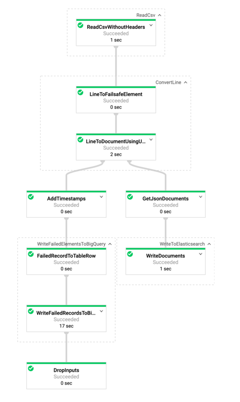

# GCS to Elasticsearch Dataflow Template

The [GCSToElasticsearch](../../src/main/java/com/google/cloud/teleport/v2/elasticsearch/templates/GCSToElasticsearch.java) pipeline ingests
data from one or more CSV files in Google Cloud Storage into Elasticsearch. The template creates the schema for the
JSON document using one of the following:
1. Javascript UDF (if provided)
2. JSON schema (if provided)
3. CSV headers* (default)

If either a UDF or JSON schema is provided then it will be used instead of the CSV headers.

\*<b>NOTE:</b> All values will be written to Elasticsearch as strings if headers are used.

Pipeline flow is illustrated below:



## Getting Started

### Requirements
* Java 8
* Maven
* Cloud Storage bucket exists
* Elasticsearch nodes are reachable from the Dataflow workers
* Csv schema is the same for all Csvs.

### Building Template
This is a Flex Template meaning that the pipeline code will be containerized, and the container will be
run on Dataflow.

#### Building Container Image
* Set environment variables that will be used in the build process.
```sh
export PROJECT=<my-project>
export IMAGE_NAME=<my-image-name>
export BUCKET_NAME=gs://<bucket-name>
export TARGET_GCR_IMAGE=gcr.io/${PROJECT}/${IMAGE_NAME}
export BASE_CONTAINER_IMAGE=gcr.io/dataflow-templates-base/java8-template-launcher-base
export BASE_CONTAINER_IMAGE_VERSION=latest
export TEMPLATE_MODULE=gcs-to-elasticsearch
export APP_ROOT=/template/googlecloud-to-elasticsearch
export COMMAND_SPEC=${APP_ROOT}/resources/${TEMPLATE_MODULE}-command-spec.json
export TEMPLATE_IMAGE_SPEC=${BUCKET_NAME}/images/${TEMPLATE_MODULE}-image-spec.json

export INPUT_FILE_SPEC=<my-file-spec>
export CONNECTION_URL=<url-or-cloud_id>
export INDEX=<my-index>
export HEADERS=false
export DEADLETTER_TABLE=<my-project:my-dataset.my-deadletter-table>
export DELIMITER=","
export ELASTICSEARCH_USERNAME=<username>
export ELASTICSEARCH_PASSWORD=<password>

gcloud config set project ${PROJECT}
```
* Build and push image to Google Container Repository
```sh
mvn clean package \
    -Dimage=${TARGET_GCR_IMAGE} \
    -Dbase-container-image=${BASE_CONTAINER_IMAGE} \
    -Dbase-container-image.version=${BASE_CONTAINER_IMAGE_VERSION} \
    -Dapp-root=${APP_ROOT} \
    -Dcommand-spec=${COMMAND_SPEC} \
    -am -pl ${TEMPLATE_MODULE}
```

#### Creating Image Spec

Create file in Cloud Storage with path to container image in Google Container Repository.
```sh
echo '{
    "image":"'${TARGET_GCR_IMAGE}'",
    "metadata":{
      "name":"GCS to Elasticsearch",
      "description":"Replicates from a file stored in GCS into Elasticsearch",
      "parameters":[
          {
              "name":"inputFileSpec",
              "label":"Pattern to where data lives",
              "helpText":"Pattern to where data lives, ex: gs://mybucket/somepath/*.csv",
              "paramType":"TEXT",
              "isOptional":false
          },
          {
              "name":"connectionUrl",
              "label":"Elasticsearch URL in the format https://hostname:[port] or specify CloudID if using Elastic Cloud",
              "helpText":"Elasticsearch URL in the format https://hostname:[port] or specify CloudID if using Elastic Cloud",
              "paramType":"TEXT",
              "isOptional":false
          },
          {
              "name":"elasticsearchUsername",
              "label":"Username for Elasticsearch endpoint",
              "helpText":"Username for Elasticsearch endpoint",
              "paramType":"TEXT",
              "isOptional":false
          },
          {
              "name":"elasticsearchPassword",
              "label":"Password for Elasticsearch endpoint",
              "helpText":"Password for Elasticsearch endpoint",
              "paramType":"TEXT",
              "isOptional":false
          },
          {
              "name":"index",
              "label":"Elasticsearch index",
              "helpText":"The index toward which the requests will be issued, ex: my-index",
              "paramType":"TEXT",
              "isOptional":false
          },
          {
              "name":"containsHeaders",
              "label":"Set to true if file(s) contain headers",
              "helpText":"Set to true if file(s) contain headers.",
              "paramType":"TEXT",
              "isOptional":false
          },
          {
              "name":"deadletterTable",
              "label":"Deadletter table in BigQuery for failed inserts",
              "helpText":"Deadletter table in BigQuery for failed inserts in form: project-id:dataset.table",
              "paramType":"TEXT",
              "isOptional":false
          },
          {
              "name":"delimiter",
              "label":"Delimiting character in CSV file(s)",
              "helpText":"Delimiting character in CSV file(s). Default: use delimiter found in csvFormat",
              "paramType":"TEXT",
              "isOptional":false
          },
          {
              "name":"inputFormat",
              "label":"Input file format",
              "helpText":"Input file format. Default is: CSV.",
              "paramType":"TEXT",
              "isOptional":true
          },
          {
              "name":"csvFormat",
              "label":"Csv format according to [Apache Commons CSV format](https",
              "helpText":"Csv format according to [Apache Commons CSV format](https://commons.apache.org/proper/commons-csv/apidocs/org/apache/commons/csv/CSVFormat.html). Default is: Default.<br><b>NOTE:</b> Must match format names exactly found [here](http://commons.apache.org/proper/commons-csv/apidocs/org/apache/commons/csv/CSVFormat.Predefined.html#Default)",
              "paramType":"TEXT",
              "isOptional":true
          },
          {
              "name":"jsonSchemaPath",
              "label":"Path to JSON schema",
              "helpText":"Path to JSON schema, ex gs://path/to/schema. Default: null.",
              "paramType":"TEXT",
              "isOptional":true
          },
          {
              "name":"largeNumFiles",
              "label":"Set to true if number of files is in the tens of thousands",
              "helpText":"Set to true if number of files is in the tens of thousands. Default: false",
              "paramType":"TEXT",
              "isOptional":true
          },
          {
              "name":"batchSize",
              "label":"Batch size in number of documents",
              "helpText":"Batch size in number of documents. Default: 1000",
              "paramType":"TEXT",
              "isOptional":true
          },
          {
              "name":"batchSizeBytes",
              "label":"Batch size in number of bytes",
              "helpText":"Batch size in number of bytes. Default: 5242880 (5mb)",
              "paramType":"TEXT",
              "isOptional":true
          },
          {
              "name":"javascriptTextTransformGcsPath",
              "label":"Gcs path to javascript udf source",
              "helpText":"Gcs path to javascript udf source. Udf will be preferred option for transformation if supplied. Default: null",
              "paramType":"TEXT",
              "isOptional":true
          },
          {
              "name":"javascriptTextTransformFunctionName",
              "label":"UDF Javascript Function Name",
              "helpText":"UDF Javascript Function Name. Default: null",
              "paramType":"TEXT",
              "isOptional":true
          },
          {
              "name":"maxRetryAttempts",
              "label":"Max retry attempts",
              "helpText":"Max retry attempts, must be > 0. Default: no retries",
              "paramType":"TEXT",
              "isOptional":true
          },
          {
              "name":"maxRetryDuration",
              "label":"Max retry duration in milliseconds",
              "helpText":"Max retry duration in milliseconds, must be > 0. Default: no retries",
              "paramType":"TEXT",
              "isOptional":true
          }
      ]
    },
    "sdk_info":{"language":"JAVA"}
}' > image_spec.json
gsutil cp image_spec.json ${TEMPLATE_IMAGE_SPEC}
rm image_spec.json
```

### Testing Template

The template unit tests can be run using:
```sh
mvn test
```

### Executing Template

The template requires the following parameters:
* inputFileSpec: Pattern to where data lives, ex: gs://mybucket/somepath/*.csv
* connectionUrl: Elasticsearch URL in format http://hostname:[port] or Base64 encoded CloudId
* index: The index toward which the requests will be issued, ex: my-index
* containsHeaders: Set to true if file(s) contain headers.
* deadletterTable: Deadletter table in BigQuery for failed inserts in form: project-id:dataset.table
* delimiter: Delimiting character in CSV file(s). Default: use delimiter found in csvFormat
* elasticsearchUsername: Elasticsearch username used to connect to Elasticsearch endpoint
* elasticsearchPassword: Elasticsearch password used to connect to Elasticsearch endpoint

The template has the following optional parameters:
* inputFormat: The format of the input files, default is CSV.
* csvFormat: Csv format according to [Apache Commons CSV format](https://commons.apache.org/proper/commons-csv/apidocs/org/apache/commons/csv/CSVFormat.html). Default is: Default
  <br><b>NOTE:</b> Must match format names exactly found [here](http://commons.apache.org/proper/commons-csv/apidocs/org/apache/commons/csv/CSVFormat.Predefined.html#Default)
* jsonSchemaPath: Path to JSON schema, ex gs://path/to/schema. Default: null.
* largeNumFiles: Set to true if number of files is in the tens of thousands. Default: false
* batchSize: Batch size in number of documents. Default: 1000
* batchSizeBytes: Batch size in number of bytes. Default: 5242880 (5mb)
* javascriptTextTransformGcsPath: Gcs path to javascript udf source. Udf will be preferred option for transformation if supplied. Default: null
* javascriptTextTransformFunctionName: UDF Javascript Function Name. Default: null
* maxRetryAttempts: Max retry attempts, must be > 0. Default: no retries
* maxRetryDuration: Max retry duration in milliseconds, must be > 0. Default: no retries

Template can be executed using the following gcloud command:
```sh
export JOB_NAME="${TEMPLATE_MODULE}-`date +%Y%m%d-%H%M%S-%N`"
gcloud beta dataflow flex-template run ${JOB_NAME} \
        --project=${PROJECT} --region=us-central1 \
        --template-file-gcs-location=${TEMPLATE_IMAGE_SPEC} \
        --parameters inputFileSpec=${INPUT_FILE_SPEC},connectionUrl=${CONNECTION_URL},index=${INDEX},elasticsearchUsername=${ELASTICSEARCH_USERNAME},elasticsearchPassword=${ELASTICSEARCH_PASSWORD},containsHeaders=${HEADERS},deadletterTable=${DEADLETTER_TABLE},delimiter=${DELIMITER}
```
