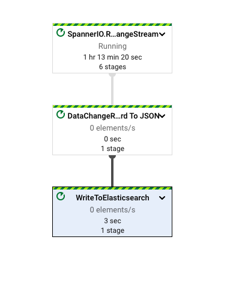

# Spanner Change Streams To Elasticsearch Dataflow Template

The [SpannerChangeStreamsToElasticsearch](../../src/main/java/com/google/cloud/teleport/v2/elasticsearch/templates/SpannerChangeStreamsToElasticsearch.java) pipeline ingests data from a Spanner Change Stream into Elasticsearch.

Pipeline flow is illustrated below:



## Getting Started

### Requirements
* Java 8
* Maven
* Spanner Instance exists
* Spanner Database exists
* Spanner Metadata Instance exists
* Spanner Metadata Database exists
* Spanner change stream exists
* Elasticsearch Instance exists (Elasticsearch 7.0 and above)

### Building Template
This is a Flex Template meaning that the pipeline code will be containerized, and the container will be
run on Dataflow.

#### Building Container Image
* Set environment variables that will be used in the build process.
```sh
export PROJECT=<my-project>
export IMAGE_NAME=<my-image-name>
export BUCKET_NAME=gs://<bucket-name>
export TARGET_GCR_IMAGE=gcr.io/${PROJECT}/${IMAGE_NAME}
export BASE_CONTAINER_IMAGE=gcr.io/dataflow-templates-base/java8-template-launcher-base
export BASE_CONTAINER_IMAGE_VERSION=latest
export TEMPLATE_MODULE=spanner-change-streams-to-elasticsearch
export APP_ROOT=/template/${TEMPLATE_MODULE}
export COMMAND_SPEC=${APP_ROOT}/resources/${TEMPLATE_MODULE}-command-spec.json
export TEMPLATE_IMAGE_SPEC=${BUCKET_NAME}/images/${TEMPLATE_MODULE}-image-spec.json

gcloud config set project ${PROJECT}
```
* Build and push image to Google Container Repository
```sh
mvn clean package \
    -Dimage=${TARGET_GCR_IMAGE} \
    -Dbase-container-image=${BASE_CONTAINER_IMAGE} \
    -Dbase-container-image.version=${BASE_CONTAINER_IMAGE_VERSION} \
    -Dapp-root=${APP_ROOT} \
    -Dcommand-spec=${COMMAND_SPEC} \
    -am -pl googlecloud-to-elasticsearch
```

#### Creating Image Spec

Create file in Cloud Storage with path to container image in Google Container Repository.
```sh
echo '{
    "image":"'${TARGET_GCR_IMAGE}'",
    "metadata":{
      "name":"Spanner Change Streams to Elasticsearch",
      "description":"Replicates Spanner Change stream data updates into an Elasticsearch index",
      "parameters":[
          {
              "label": "Spanner instance ID",
              "help_text": "The Spanner instance to read change streams from.",
              "name": "spannerInstanceId",
              "param_type": "TEXT"
          },
          {
              "label": "Spanner database ID",
              "help_text": "The Spanner database to read change streams from.",
              "name": "spannerDatabase",
              "param_type": "TEXT"
          },
          {
              "label": "Spanner metadata instance ID",
              "help_text": "The Spanner instance to use for the change stream metadata table.",
              "name": "spannerMetadataInstanceId",
              "param_type": "TEXT"
          },
          {
              "label": "Spanner metadata database ID",
              "help_text": "The Spanner database to use for the change stream metadata table.",
              "name": "spannerMetadataDatabase",
              "param_type": "TEXT"
          },
          {
              "label": "Spanner change stream",
              "help_text": "The Spanner change stream to read from.",
              "name": "spannerChangeStreamName",
              "param_type": "TEXT"
          },
          {
            "label": "Spanner Project ID",
            "help_text": "Project to read change streams from. The default for this parameter is the project where the Dataflow pipeline is running.",
            "name": "spannerProjectId",
            "is_optional": true,
            "param_type": "TEXT"
          },
          {
              "label": "Pipeline start time",
              "help_text": "The starting DateTime to use for reading change streams (https://tools.ietf.org/html/rfc3339). Defaults to now.",
              "name": "startTimestamp",
              "is_optional": true,
              "param_type": "TEXT"
          },
          {
              "label": "Pipeline end time",
              "help_text": "The ending DateTime to use for reading change streams (https://tools.ietf.org/html/rfc3339). Defaults to max, which represents an infinite time in the future.",
              "name": "endTimestamp",
              "is_optional": true,
              "param_type": "TEXT"
          },
          {
            "label": "The RPC priority.",
            "help_text": "Priority for Spanner RPC invocations. Defaults to HIGH. Allowed priorities are LOW, MEDIUM,HIGH. Defaults to HIGH",
            "name": "rpcPriority",
            "is_optional": true,
            "param_type": "TEXT"
          },
          {
              "name":"connectionUrl",
              "label":"Elasticsearch URL in the format https://hostname:[port] or specify CloudID if using Elastic Cloud",
              "helpText":"Elasticsearch URL in the format https://hostname:[port] or specify CloudID if using Elastic Cloud",
              "paramType":"TEXT"
          },
          {
              "name":"elasticsearchUsername",
              "label":"Username for Elasticsearch endpoint",
              "helpText":"Username for Elasticsearch endpoint",
              "paramType":"TEXT"
          },
          {
              "name":"elasticsearchPassword",
              "label":"Password for Elasticsearch endpoint",
              "helpText":"Password for Elasticsearch endpoint",
              "paramType":"TEXT"
          },
          {
            "name":"apiKey",
            "label":"Elasticsearch apiKey",
            "helpText":"API key for access without requiring basic authentication.",
            "paramType":"TEXT"
          },
          {
              "name":"index",
              "label":"Elasticsearch index",
              "helpText":"The index toward which the requests will be issued, ex: my-index",
              "paramType":"TEXT"
          },
          {
              "name":"batchSize",
              "label":"Batch size in number of documents",
              "helpText":"Batch size in number of documents. Default: 1000",
              "paramType":"TEXT",
              "isOptional":true
          },
          {
              "name":"batchSizeBytes",
              "label":"Batch size in number of bytes",
              "helpText":"Batch size in number of bytes. Default: 5242880 (5mb)",
              "paramType":"TEXT",
              "isOptional":true
          },
          {
              "name":"maxRetryAttempts",
              "label":"Max retry attempts",
              "helpText":"Max retry attempts, must be > 0. Default: no retries",
              "paramType":"TEXT",
              "isOptional":true
          },
          {
              "name":"maxRetryDuration",
              "label":"Max retry duration in milliseconds",
              "helpText":"Max retry duration in milliseconds, must be > 0. Default: no retries",
              "paramType":"TEXT",
              "isOptional":true
          },
          {
              "name":"propertyAsIndex",
              "label":"Document property used to specify _index metadata with document in bulk request",
              "helpText":"A property in the document being indexed whose value will specify _index metadata to be included with document in bulk request (takes precendence over an index UDF)",
              "paramType":"TEXT",
              "isOptional":true
          },
          {
              "name":"javaScriptIndexFnGcsPath",
              "label":"GCS path to JavaScript UDF source for function that will specify _index metadata to be included with document in bulk request",
              "helpText":"GCS path to JavaScript UDF source. Default: null",
              "paramType":"TEXT",
              "isOptional":true
          },
          {
              "name":"javaScriptIndexFnName",
              "label":"UDF JavaScript Function Name for function that will specify _index metadata to be included with document in bulk request",
              "helpText":"UDF JavaScript Function Name. Default: null",
              "paramType":"TEXT",
              "isOptional":true
          },
          {
              "name":"propertyAsId",
              "label":"Document property used to specify _id metadata with document in bulk request",
              "helpText":"A property in the document being indexed whose value will specify _id metadata to be included with document in bulk request (takes precendence over an index UDF)",
              "paramType":"TEXT",
              "isOptional":true
          },
          {
              "name":"javaScriptIdFnGcsPath",
              "label":"GCS path to JavaScript UDF source function that will specify _id metadata to be included with document in bulk request",
              "helpText":"GCS path to JavaScript UDF source. Default: null",
              "paramType":"TEXT",
              "isOptional":true
          },
          {
              "name":"javaScriptIdFnName",
              "label":"UDF JavaScript Function Name for function that will specify _id metadata to be included with document in bulk request",
              "helpText":"UDF JavaScript Function Name. Default: null",
              "paramType":"TEXT",
              "isOptional":true
          },
          {
              "name":"javaScriptTypeFnGcsPath",
              "label":"GCS path to JavaScript UDF source for function that will specify _type metadata to be included with document in bulk request",
              "helpText":"GCS path to JavaScript UDF source. Default: null",
              "paramType":"TEXT",
              "isOptional":true
          },
          {
              "name":"javaScriptTypeFnName",
              "label":"UDF JavaScript Function Name for function that will specify _type metadata to be included with document in bulk request",
              "helpText":"UDF JavaScript Function Name. Default: null",
              "paramType":"TEXT",
              "isOptional":true
          },
          {
              "name":"javaScriptIsDeleteFnGcsPath",
              "label":"GCS path to JavaScript UDF source for function that will determine if document should be deleted rather than inserted or updated, function should return string value \"true\" or \"false\"",
              "helpText":"GCS path to JavaScript UDF source. Default: null",
              "paramType":"TEXT",
              "isOptional":true
          },
          {
              "name":"javaScriptIsDeleteFnName",
              "label":"UDF JavaScript Function Name for function that will determine if document should be deleted rather than inserted or updated, function should return string value \"true\" or \"false\"",
              "helpText":"UDF JavaScript Function Name. Default: null",
              "paramType":"TEXT",
              "isOptional":true
          },
          {
              "name":"bulkInsertMethod",
              "label":"Use INDEX (index, allows upserts) or CREATE (create, errors on duplicate _id) in bulk requests",
              "helpText":"Whether to use INDEX (index, allows upserts) or the default CREATE (create, errors on duplicate _id) with Elasticsearch bulk requests",
              "paramType":"TEXT",
              "isOptional":true
          }
      ]
    },
    "sdk_info":{"language":"JAVA"}
}' > image_spec.json
gsutil cp image_spec.json ${TEMPLATE_IMAGE_SPEC}
rm image_spec.json
```

### Testing Template

The template unit tests can be run using:
```sh
mvn test
```

### Executing Template

The template requires the following parameters:
* connectionUrl: Elasticsearch URL in format http://hostname:[port] or Base64 encoded CloudId
* index: The index toward which the requests will be issued, ex: my-index
* elasticsearchUsername: Elasticsearch username used to connect to Elasticsearch endpoint
* elasticsearchPassword: Elasticsearch password used to connect to Elasticsearch endpoint
* apiKey: Base64 Encoded API Key for access without requiring basic authentication. Refer  https://www.elastic.co/guide/en/elasticsearch/reference/current/security-api-create-api-key.html#security-api-create-api-key-request.
* spannerInstanceId: The Spanner Instance ID
* spannerDatabaseId: The Spanner database ID
* spannerMetadataInstanceId: The Spanner Metadata Instance ID.
* spannerMetadataDatabaseId: The Spanner Metadata Database ID.
* spannerChangeStream: The Spanner change stream.

The template has the following optional parameters:
* batchSize: Batch size in number of documents. Default: 1000
* batchSizeBytes: Batch size in number of bytes. Default: 5242880 (5mb)
* maxRetryAttempts: Max retry attempts, must be > 0. Default: no retries
* maxRetryDuration: Max retry duration in milliseconds, must be > 0. Default: no retries
* propertyAsIndex: A property in the document being indexed whose value will specify _index metadata to be included with document in bulk request (takes precendence over an index UDF)
* javaScriptIndexFnGcsPath: GCS path of storage location for JavaScript UDF that will specify _index metadata to be included with document in bulk request
* javaScriptIndexFnName: Function name for JavaScript UDF that will specify _index metadata to be included with document in bulk request
* propertyAsId: A property in the document being indexed whose value will specify _id metadata to be included with document in bulk request (takes precendence over an index UDF)
* javaScriptIdFnGcsPath: GCS path of storage location for JavaScript UDF that will specify _id metadata to be included with document in bulk request
* javaScriptIdFnName: Function name for JavaScript UDF that will specify _id metadata to be included with document in bulk request
* javaScriptTypeFnGcsPath: GCS path of storage location for JavaScript UDF that will specify _type metadata to be included with document in bulk request
* javaScriptTypeFnName: Function name for JavaScript UDF that will specify _type metadata to be included with document in bulk request
* javaScriptIsDeleteFnGcsPath: GCS path of storage location for JavaScript UDF that will determine if document should be deleted rather than inserted or updated, function should return string value "true" or "false"
* javaScriptIsDeleteFnName: Function name for JavaScript UDF that will determine if document should be deleted rather than inserted or updated, function should return string value "true" or "false"
* spannerProjectId: The project containing the spanner instance (default uses same project as template runs in)
* startTimestamp: The starting DateTime to use for reading change streams. Defaults to now.
* endTimestamp: The ending DateTime to use for reading change streams. Defaults to infinite.
* rpcPriority: The priority for Spanner RPC priority. Defaults to HIGH.
* bulkInsertMethod: Whether to use INDEX (index, allows upserts) or the default CREATE (create, errors on duplicate _id) with Elasticsearch bulk requests

Template can be executed using the following gcloud command:
```sh
export JOB_NAME="${TEMPLATE_MODULE}-`date +%Y%m%d-%H%M%S-%N`"
export PROJECT=<my-project>
export BUCKET_NAME=gs://<bucket-name>
export TEMPLATE_MODULE=spanner-change-streams-to-elasticsearch
export TEMPLATE_IMAGE_SPEC=${BUCKET_NAME}/images/${TEMPLATE_MODULE}-image-spec.json

export CONNECTION_URL=<url-or-cloud_id>
export INDEX=<my-index>
export ELASTICSEARCH_API_KEY=<api-key>
export ELASTICSEARCH_USERNAME=<username>
export ELASTICSEARCH_PASSWORD=<password>
export JS_ID_FN_GCS_PATH=<javascript-id-extract-gcs-path>
export JS_ID_FN_NAME=<javascript-id-extract-function-name>
export JS_IS_DELETE_FN_GCS_PATH=<javascript-delete-operation-determination-gcs-path>
export JS_IS_DELETE_FN_NAME=<javascript-delete-operation-determination-function-name>
export SPANNER_INSTANCE=<spanner-instance>
export SPANNER_DATABASE=<spanner-database>
export SPANNER_METADATA_INSTANCE=<spanner-metadata-instance>
export SPANNER_METADATA_DATABASE=<spanner-metadata-database>
export SPANNER_CHANGE_STREAM=<spanner-changestream>

gcloud dataflow flex-template run ${JOB_NAME} \
        --project=${PROJECT} --region=us-central1 \
        --template-file-gcs-location=${TEMPLATE_IMAGE_SPEC} \
        --parameters connectionUrl=${CONNECTION_URL},index=${INDEX},apiKey=${ELASTICSEARCH_API_KEY},javaScriptIdFnGcsPath=${JS_ID_FN_GCS_PATH},javaScriptIdFnName=${JS_ID_FN_NAME},javaScriptIsDeleteFnGcsPath=${JS_IS_DELETE_FN_GCS_PATH},javaScriptsDeleteFnName=${JS_IS_DELETE_FN_NAME},spannerInstanceId=${SPANNER_INSTANCE},spannerDatabaseId=${SPANNER_DATABASE},spannerMetadataInstanceId=${SPANNER_METADATA_INSTANCE},spannerMetadataDatabaseId=${SPANNER_METADATA_DATABASE},spannerChangeStreamName=${SPANNER_CHANGE_STREAM}
```