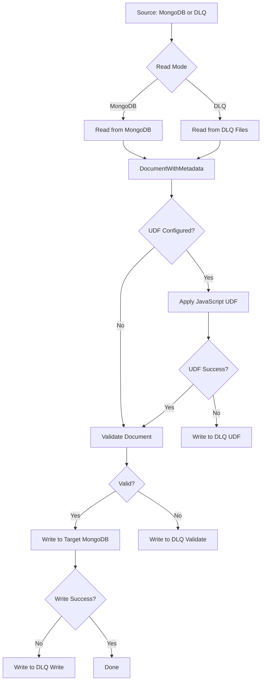

# MongoDB to MongoDB Dataflow Template

This template copies data from a source MongoDB database to a target MongoDB database. It supports reading from a specific collection or all collections in a database, applying an optional JavaScript UDF for transformation, and handling failures via a Dead Letter Queue (DLQ).

## High-Level Workflow



## Inputs

| Parameter | Type | Description | Required | Default |
| :--- | :--- | :--- | :--- | :--- |
| `sourceUri` | String | URI to connect to the source MongoDB cluster. | Yes | |
| `targetUri` | String | URI to connect to the target MongoDB cluster. | Yes | |
| `sourceDatabase` | String | Database in the source MongoDB to read from. | Yes | |
| `targetDatabase` | String | Database in the target MongoDB to write to. | Yes | |
| `sourceCollection` | String | Collection in the source MongoDB to read from. If not provided, all collections will be migrated. | No | |
| `targetCollection` | String | Collection in the target MongoDB to write to. If not provided, source collection names will be used. | No | |
| `useBucketAuto` | Boolean | Enable withBucketAuto for Atlas compatibility. | No | false |
| `numSplits` | Integer | Suggest a specific number of partitions for reading. | No | |
| `batchSize` | Integer | Number of documents in a bulk write. | No | 5000 |
| `dlqDirectory` | String | Base path to store failed events. | No | `tempLocation`/tmp |
| `maxConcurrentAsyncWrites` | Integer | Maximum number of concurrent asynchronous batch writes per worker. | No | 10 |
| `maxWriteRetries` | Integer | Maximum number of retry attempts for transient failures during write. | No | 3 |
| `dlqMaxRetries` | Integer | Maximum number of times to retry events from DLQ. | No | 3 |
| `readFromDlq` | Boolean | If true, reads only from DLQ for retry. If false, reads from MongoDB. | No | false |
| `reconsumeDlqPath` | String | Path to read files from DLQ for reprocessing. Required if `readFromDlq` is true. | No | |

### Configuring a MongoDB Source

- **Connection URI**: Provide the standard MongoDB connection string in `sourceUri`.
- **Database and Collection**: Specify `sourceDatabase` and `sourceCollection`.
- **All Collections Migration**: If you omit `sourceCollection`, the template will query the source database for a list of all collections and create a separate pipeline branch to process each collection. This allows for full database migration.

### Configuring a DLQ Source

To reprocess documents that failed in a previous run and were written to the DLQ:
1. Set `readFromDlq` to `true`.
2. Set `reconsumeDlqPath` to the specific directory containing the failed files (e.g., `gs://your-bucket/dlq/2026-05-07/12-00-00/retryable`).
3. The template will read these files, parse the JSON representations of the failed documents, and attempt to process and write them again.

## Mongo Target

Regardless of whether the pipeline is configured to read from a MongoDB source or from DLQ files (reconsume mode), the data will always be written to the specified MongoDB target. The target is configured using `targetUri` and `targetDatabase`. Documents will be routed to collections based on the `targetCollection` parameter or dynamically routed to match the source collection name if `targetCollection` is omitted.


## User Defined Functions (UDF)

You can apply a JavaScript UDF to transform documents before they are written to the target.

### Defining a UDF

- The UDF must be a JavaScript function that accepts a single string argument (the JSON representation of the MongoDB document) and returns a string (the JSON representation of the transformed document).
- If the UDF returns `null` or throws an exception, the document is considered failed and will be sent to the DLQ.

### Example UDF

```javascript
function transform(inJson) {
  var obj = JSON.parse(inJson);

  // Example of throwing an error (sends document to DLQ)
  if (!obj.userId) {
    throw new Error("Missing required field: userId");
  }

  // Example of renaming a field
  if (obj.oldFieldName) {
    obj.newFieldName = obj.oldFieldName;
    delete obj.oldFieldName;
  }

  // Add a processed flag
  obj.processed = true;

  // Add a timestamp
  obj.processTimestamp = new Date().getTime();

  // Remove sensitive field
  delete obj.sensitiveData;

  return JSON.stringify(obj);
}
```

## Dead Letter Queue Configuration

The template uses a file-based DLQ to store documents that fail processing or writing.

### Event Format

Failures are written as JSON lines. Each line is a JSON object with the following structure:

```json
{
  "data": { ... }, // The original document content
  "_metadata_retry_count": 1, // Number of times this event has been retried
  "_metadata_error_type": "RETRYABLE", // RETRYABLE or PERMANENT
  "_metadata_source_collection": "source_col", // Source collection name
  "_metadata_target_collection": "target_col", // Target collection name
  "_metadata_error_message": "Error description", // Reason for failure
  "_metadata_failure_stage": "WRITE" // UDF, VALIDATE, or WRITE
}
```


### Directory Structure

Failures are organized under the `dlqDirectory` (or `tempLocation`/tmp if not specified) with the following structure:
`dlqDirectory/YYYY-MM-DD/HH-mm-ss/[retryable|permanent]/part-file`

- **`retryable`**: Contains documents that failed due to transient errors (e.g., network issues, temporary unavailability) or UDF failures that might be fixed by correcting the UDF. These can be reprocessed by setting `readFromDlq` to `true`.
- **`permanent`**: Contains documents that failed due to non-retriable errors (e.g., duplicate keys, schema validation failures in MongoDB, document too large). These should be inspected manually.

### Error Categorization

- **UDF Failures**: Sent to `retryable`.
- **Validation Failures**: Sent to `permanent` (e.g., if document is null).
- **Write Failures**:
    - Permanent errors (Duplicate Key, Document Validation Failure, Key Too Long, Bad Value) go to `permanent`.
    - Other errors are retried up to `maxWriteRetries`. If still failing, they go to `retryable`.

## Performance Configurations

To optimize performance, consider the following parameters:

- **`batchSize`**: Controls how many documents are sent in a single bulk write operation. Larger sizes can improve throughput but increase memory usage. Default is 5000.
- **`maxConcurrentAsyncWrites`**: Controls the number of concurrent bulk write operations per worker. Increasing this can increase throughput if the target MongoDB cluster can handle the load. Default is 10.
- **`numSplits`**: Suggests the number of splits for reading from MongoDB. This affects the initial parallelism of the read stage.
- **`useBucketAuto`**: When set to `true`, uses MongoDB's `$bucketAuto` to determine split points. This is often more efficient, especially on Atlas clusters where traditional split methods might be slow or unavailable.
- **`numberOfWorkerHarnessThreads`**: This is a standard Dataflow flag (set via `--numberOfWorkerHarnessThreads`) that controls the number of threads per worker. Increasing this allows the worker to process more bundles in parallel, which can increase throughput but also increases memory and resource contention. It complements `maxConcurrentAsyncWrites` by allowing more concurrent work on the worker level before hitting the write throttle.
