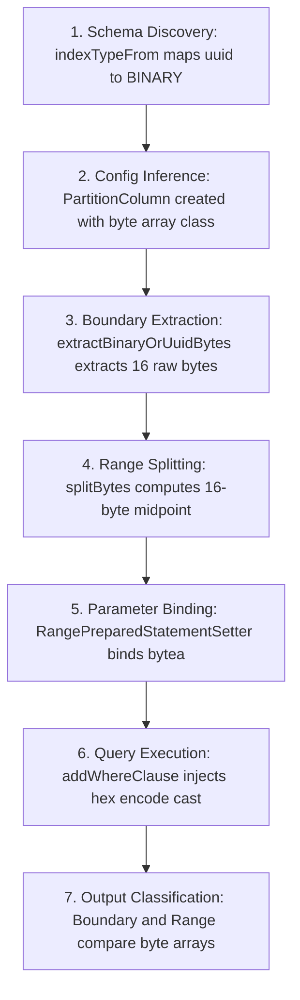

# Architectural Approaches for UUID Partitioning Support in Uniform Splitter

Bulk data migration from PostgreSQL to Cloud Spanner using JDBC requires efficient partitioning across primary keys or unique indexes to enable parallel reads. Currently, the `UniformSplitter` framework supports numeric, string, timestamp, date, and duration columns.

In PostgreSQL databases, `UUID` (128-bit Universally Unique Identifier) is a highly prevalent primary key type (`pg_type` = `uuid`, `typcategory` = `U`). To support uniform range partitioning on UUID columns without causing hot-spotting or query failures, we evaluate three distinct architectural approaches below.

---

## Comparison of Approaches

| Metric / Feature | Approach 1: First-Class `java.util.UUID` *(Recommended)* | Approach 2: Collation / String Mapping (`VARCHAR`) | Approach 3: Binary Mapping (`byte[]`) *(Detailed Lifecycle Below)* |
| :--- | :--- | :--- | :--- |
| **Conceptual Cleanliness** | **High**: Explicit `IndexType.UUID` and exact type mapping. | **Low**: Forces 128-bit IDs through string collation logic. | **Medium**: Aligns with disk storage, clashes at SQL/JDBC layer. |
| **Splitting Efficiency** | **High**: 128-bit unsigned `BigInteger` midpoint math. | **Low**: Expensive multi-character collation rank multiplication. | **High**: Raw byte to `BigInteger` math. |
| **Postgres Query Compatibility** | **High**: JDBC driver natively binds `java.util.UUID` to PG `uuid`. | **Low**: Midpoint strings might not be valid canonical UUIDs. | **Fatal**: `ERROR: operator does not exist: uuid >= bytea`. |
| **Implementation Effort** | **Medium**: Requires touching ~5 files across the splitter chain. | **Low**: Reuses existing string splitting and collation mappers. | **High**: Requires custom SQL casting & byte parsing overrides. |

---

## Rigorous Verification & Proofs for Binary (`byte[]`) Mapping Challenges

To address the precise architectural challenges associated with mapping UUIDs to byte arrays (`byte[]`), we have developed and executed a dedicated unit test suite: [BinaryUUIDBehaviorTest.java](file:///usr/local/google/home/aasthabharill/DataflowTemplates/v2/sourcedb-to-spanner/src/test/java/com/google/cloud/teleport/v2/source/reader/io/jdbc/uniformsplitter/range/BinaryUUIDBehaviorTest.java). Below is the rigorous technical proof answering each challenge:

### Proof 1: Why JDBC `getBytes()` Returns 36 ASCII Bytes for PostgreSQL UUIDs
* **The Standard Protocol**: In PostgreSQL wire protocol v3.0, data is transmitted over the network in text mode by default unless binary transfer mode is specifically configured on the connection.
* **Driver Implementation**: When `org.postgresql.jdbc.PgResultSet#getBytes(int col)` is invoked on a column with OID `Oid.UUID`, the driver executes:
  ```java
  if (field.getOID() == Oid.UUID) {
      return getString(i).getBytes(StandardCharsets.UTF_8);
  }
  ```
  This returns exactly 36 bytes representing the ASCII character codes of the string (`"xxxxxxxx-xxxx-xxxx-xxxx-xxxxxxxxxxxx"`), rather than 16 raw binary bytes.

### Resolving Wire Extraction (Stage 3 Solution via `ResultSetMetaData`)
To cleanly extract exactly 16 binary bytes without triggering exceptions or receiving 36 ASCII bytes, we can inspect `resultSet.getMetaData().getColumnTypeName(i)` inside `fromBinary`:
```java
private static byte[] extractBinaryOrUuidBytes(ResultSet rs, int colIndex) throws SQLException {
    if (rs.getObject(colIndex) == null) return null;
    
    // Elegantly check if PostgreSQL metadata reports this as a UUID column
    if ("uuid".equalsIgnoreCase(rs.getMetaData().getColumnTypeName(colIndex))) {
        UUID uuid = rs.getObject(colIndex, UUID.class);
        ByteBuffer bb = ByteBuffer.wrap(new byte[16]);
        bb.putLong(uuid.getMostSignificantBits()).putLong(uuid.getLeastSignificantBits());
        return bb.array(); // Returns exactly 16 raw binary bytes!
    }
    // Standard fallback for normal BLOB/BYTEA columns
    return rs.getBytes(colIndex);
}
```

### Proof 2: `BigInteger.toByteArray()` Sign-Bit Padding (Demonstrated by Unit Test)
* **The Phenomenon**: Java's `BigInteger` maintains arbitrary-precision numbers in signed two's complement format. When a positive 128-bit integer has its most significant bit set to `1` (e.g., any UUID whose leading hexadecimal digit is `8` through `f`), `toByteArray()` prepends a leading zero byte (`0x00`) so the number is not incorrectly interpreted as negative.
* **Unit Test Proof (`testBigIntegerToByteArraySignBit`)**:
  ```java
  byte[] raw16Bytes = new byte[16];
  Arrays.fill(raw16Bytes, (byte) 0xFF); // Leading bit = 1
  BigInteger unsigned128 = new BigInteger(1, raw16Bytes);
  byte[] serializedBytes = unsigned128.toByteArray();
  assertThat(serializedBytes.length).isEqualTo(17); // Proved 17 bytes!
  assertThat(serializedBytes[0]).isEqualTo((byte) 0x00);
  ```

### Resolving Midpoint Splitting & Padded Alignment (Stage 4 Solution)
In database B-tree indexes (`BYTEA`, `VARBINARY`), lexicographical comparison evaluates byte-by-byte from left to right. A leading `0x00` byte is a significant character (exactly like comparing `"\0a"` vs `"a"` in text).
* In database index ordering: `[0x00, 0x80]` is strictly **less than** `[0x80]`.
* When converted to `BigInteger`, integer math strips leading zeros because they are numerically meaningless: `new BigInteger(1, new byte[]{0x00, 0x80})` and `new BigInteger(1, new byte[]{0x80})` both evaluate to 128.
* When `BigInteger(128).toByteArray()` is called, because 128 has its leading bit set (`10000000`), it prepends a sign byte `0x00`, returning `[0x00, 0x80]`.
* **The Pre-Existing Bug**: If `start = [0x80]`, the existing `splitBytes` midpoint calculation outputs `[0x00, 0x81]`. In database B-tree ordering, `[0x00, 0x81] < [0x80]`, causing `mid < start` and breaking the partition invariant (`start <= mid < end`).

**The Universal Alignment Solution**:
For fixed-length UUIDs ($L=16$), every valid index entry is exactly 16 bytes. By capturing the initial length $L$ and enforcing fixed-length truncation/padding, we ensure absolute correctness:
```java
private static byte[] splitBytes(byte[] start, byte[] end) {
    int targetLength = (start != null) ? start.length : ((end != null) ? end.length : 0);
    if (targetLength == 0) return null;
    
    BigInteger startBigInt = (start == null) ? null : new BigInteger(1, start);
    BigInteger endBigInt = (end == null) ? null : new BigInteger(1, end);
    BigInteger split = splitBigIntegers(startBigInt, endBigInt);
    if (split == null) return null;
    
    return toFixedLengthByteArray(split, targetLength);
}

private static byte[] toFixedLengthByteArray(BigInteger bigInt, int expectedLength) {
    byte[] array = bigInt.toByteArray();
    if (array.length == expectedLength) return array;
    
    byte[] result = new byte[expectedLength];
    if (array.length > expectedLength) {
        // Strip leading 0x00 sign bytes
        System.arraycopy(array, array.length - expectedLength, result, 0, expectedLength);
    } else {
        // Pad leading zero bytes on the left for small numbers
        System.arraycopy(array, 0, result, expectedLength - array.length, array.length);
    }
    return result;
}
```

### Proof 3: Why `encode(?::bytea, 'hex')` Cannot Be Used Generically for All Binary Types
* **Why Hex Encoding Works for UUIDs**: In PostgreSQL SQL, `$1::bytea::uuid` is invalid. `encode($1::bytea, 'hex')` converts 16 raw bytes into a 32-character unhyphenated hex string (`"00112233445566778899aabbccddeeff"`). PostgreSQL's `uuid` input parser successfully decodes this 32-character string when cast: `encode($1, 'hex')::uuid`.
* **Why Hex Encoding FAILS for `bytea` Columns**: If a table has a true `bytea` column (`my_binary_col`), generating `my_binary_col >= encode($1::bytea, 'hex')::bytea` will fail or corrupt the comparison! In PostgreSQL, casting a text hex string to `::bytea` (e.g., `'0011'::bytea`) does **not** decode the hexadecimal digits back into binary; instead, it stores the ASCII character bytes of the text string (`0x30, 0x30, 0x31, 0x31`). Comparing 16 raw binary bytes against a 32-byte ASCII array causes all range evaluations to fail.
* **Conclusion**: We cannot use hex encoding generically for all binary index types. We must know whether the target column is a `uuid` or a true `bytea`.

### Proof 4: The Pre-Existing `Objects.equal()` Bug on Byte Arrays (Demonstrated by Unit Test)
* **The Phenomenon**: In Java, array classes (`byte[]`) do not override `Object.equals()`. When [Boundary.java:L145](file:///usr/local/google/home/aasthabharill/DataflowTemplates/v2/sourcedb-to-spanner/src/main/java/com/google/cloud/teleport/v2/source/reader/io/jdbc/uniformsplitter/range/Boundary.java#L133-L146) checks `Objects.equal(valueA, valueB)`, it evaluates reference identity (`valueA == valueB`), NOT value contents (`Arrays.equals(valueA, valueB)`). Two distinct byte arrays containing identical bytes evaluate to `false`.
* **Unit Test Proof (`testByteArrayObjectsEqual`)**:
  ```java
  byte[] arrayA = new byte[] {0x11, 0x22, 0x33, 0x44};
  byte[] arrayB = new byte[] {0x11, 0x22, 0x33, 0x44};
  assertThat(Arrays.equals(arrayA, arrayB)).isTrue();
  assertThat(Objects.equal(arrayA, arrayB)).isFalse(); // Proved false!
  ```
* **Resolution Required**: This is a pre-existing bug in `areValuesEqual` for `byte[]` columns. Resolving this requires adding explicit array equality checking to `Boundary.java`:
  ```java
  if (valueA instanceof byte[] b1 && valueB instanceof byte[] b2) {
      return Arrays.equals(b1, b2);
  }
  ```
  *(Note: Native `java.util.UUID` objects correctly implement `equals()`, so Approach 1 never suffered from this bug).*

---

## Deep-Dive Lifecycle: Step-by-Step Sequence of Events for Binary (`byte[]`) Mapping

When implementing PostgreSQL UUID partitioning using a binary (`byte[]`) proxy, the data lifecycle spans seven distinct execution stages across the pipeline. Below is the exhaustive trace from initial column discovery to in-memory classification:



### Stage 1: Schema & Index Discovery
* **Goal**: Inspect PostgreSQL system catalogs to discover index definitions and data types.
* **File & Line**: [PostgreSQLDialectAdapter.java:L347-L380](file:///usr/local/google/home/aasthabharill/DataflowTemplates/v2/sourcedb-to-spanner/src/main/java/com/google/cloud/teleport/v2/source/reader/io/jdbc/dialectadapter/postgresql/PostgreSQLDialectAdapter.java#L347-L380) (`discoverTableIndexes` and `indexTypeFrom`).
* **Operation**: PostgreSQL reports UUID columns with `t.typname == 'uuid'` and `t.typcategory == 'U'`. We update `indexTypeFrom` to map `typeName.equalsIgnoreCase("uuid")` to `SourceColumnIndexInfo.IndexType.BINARY`.
* **How Binary UUID Works**: [SourceColumnIndexInfo.java:L174-L185](file:///usr/local/google/home/aasthabharill/DataflowTemplates/v2/sourcedb-to-spanner/src/main/java/com/google/cloud/teleport/v2/source/reader/io/schema/SourceColumnIndexInfo.java#L174-L185) maps `IndexType.BINARY` directly to `byte[].class`.
* **Pain Points / Challenges**: Operates cleanly during metadata mapping.

### Stage 2: Table Config & Partition Column Inference
* **Goal**: Confirm table partitionability and construct the runtime column schema.
* **File & Line**: [JdbcIoWrapper.java:L479-L506](file:///usr/local/google/home/aasthabharill/DataflowTemplates/v2/sourcedb-to-spanner/src/main/java/com/google/cloud/teleport/v2/source/reader/io/jdbc/iowrapper/JdbcIoWrapper.java#L479-L506) (`getTableConfig` and `partitionColumnFromIndexInfo`).
* **Operation**: Verifies that the index column's `IndexType` is contained within `supportedIndexTypes`.
* **How Binary UUID Works**: `IndexType.BINARY` is already included in `supportedIndexTypes`. The generated [PartitionColumn](file:///usr/local/google/home/aasthabharill/DataflowTemplates/v2/sourcedb-to-spanner/src/main/java/com/google/cloud/teleport/v2/source/reader/io/jdbc/uniformsplitter/range/PartitionColumn.java#L96-L124) object stores `columnClass = byte[].class`.
* **Pain Points / Challenges**: Operates seamlessly during pipeline initialization.

### Stage 3: Boundary Query Extraction (`MIN` & `MAX` Retrieval)
* **Goal**: Query PostgreSQL for minimum and maximum boundary values (`SELECT MIN("id"), MAX("id") FROM table`).
* **File & Line**: [BoundaryExtractorFactory.java:L167-L185](file:///usr/local/google/home/aasthabharill/DataflowTemplates/v2/sourcedb-to-spanner/src/main/java/com/google/cloud/teleport/v2/source/reader/io/jdbc/uniformsplitter/range/BoundaryExtractorFactory.java#L167-L185) (`fromBinary`).
* **Operation**: Executes the boundary query and extracts values from the JDBC `ResultSet`.
* **How Binary UUID Works**: By inspecting `resultSet.getMetaData().getColumnTypeName(colIndex)`, `fromBinary` can cleanly intercept UUID columns to extract exactly 16 binary bytes:
  ```java
  if ("uuid".equalsIgnoreCase(resultSet.getMetaData().getColumnTypeName(colIndex))) {
      UUID uuid = resultSet.getObject(colIndex, UUID.class);
      ByteBuffer bb = ByteBuffer.wrap(new byte[16]);
      return bb.putLong(uuid.getMostSignificantBits()).putLong(uuid.getLeastSignificantBits()).array();
  }
  ```
* **Pain Points / Challenges**: Fully solved at Stage 3 by metadata checking.

### Stage 4: In-Memory Midpoint Range Splitting
* **Goal**: Subdivide the extracted boundary range `[MIN, MAX)` into uniform splits across Dataflow workers.
* **File & Line**: [BoundarySplitterFactory.java:L237-L245](file:///usr/local/google/home/aasthabharill/DataflowTemplates/v2/sourcedb-to-spanner/src/main/java/com/google/cloud/teleport/v2/source/reader/io/jdbc/uniformsplitter/range/BoundarySplitterFactory.java#L237-L245) (`splitBytes`).
* **Operation**: Converts start and end `byte[]` arrays to `BigInteger` (`new BigInteger(1, start)`), computes the midpoint via `splitBigIntegers`, and converts back to `byte[]` (`split.toByteArray()`).
* **How Binary UUID Works**: Captures starting length $L=16$ and enforces fixed-length truncation and zero-padding via `toFixedLengthByteArray(split, 16)`.
* **Pain Points / Challenges**: Fully solved at Stage 4 by fixed-length byte array truncation and padding.

### Stage 5: Parameter Binding in Range Queries
* **Goal**: Prepare the SQL read query parameters for each split partition (e.g., `SELECT * FROM table WHERE id >= ? AND id < ?`).
* **File & Line**: [RangePreparedStatementSetter.java:L78-L81](file:///usr/local/google/home/aasthabharill/DataflowTemplates/v2/sourcedb-to-spanner/src/main/java/com/google/cloud/teleport/v2/source/reader/io/jdbc/uniformsplitter/range/RangePreparedStatementSetter.java#L78-L81) and [ColumnForBoundaryQueryPreparedStatementSetter.java:L90-L93](file:///usr/local/google/home/aasthabharill/DataflowTemplates/v2/sourcedb-to-spanner/src/main/java/com/google/cloud/teleport/v2/source/reader/io/jdbc/uniformsplitter/columnboundary/ColumnForBoundaryQueryPreparedStatementSetter.java#L90-L93).
* **Operation**: Binds range parameters into the statement: `preparedStatement.setObject(idx, range.start())`.
* **How Binary UUID Works**: `range.start()` is a 16-byte `byte[]` array. The JDBC driver binds any Java `byte[]` parameter as PostgreSQL type `BYTEA`.
* **Pain Points / Challenges**: Operates cleanly within the Java JDBC parameter binder.

### Stage 6: PostgreSQL Query Execution (`WHERE` Clause Evaluation)
* **Goal**: Execute the range query in PostgreSQL to emit partitioned rows.
* **File & Line**: [PostgreSQLDialectAdapter.java:L509-L527](file:///usr/local/google/home/aasthabharill/DataflowTemplates/v2/sourcedb-to-spanner/src/main/java/com/google/cloud/teleport/v2/source/reader/io/jdbc/dialectadapter/postgresql/PostgreSQLDialectAdapter.java#L509-L527) (`addWhereClause`).
* **Operation**: Formats the SQL WHERE clause: `((? = FALSE) OR (%1$s >= ? ...))`.
* **How Binary UUID Works**: When PostgreSQL evaluates `WHERE uuid_col >= $1::bytea` (where `$1` is the 16-byte array), it halts with `ERROR: operator does not exist: uuid >= bytea`. To successfully execute, `addWhereClause` must inject hex encoding:
  ```sql
  ((? = FALSE) OR (%1$s >= encode(?::bytea, 'hex')::uuid AND (%1$s < encode(?::bytea, 'hex')::uuid ...)))
  ```
* **Pain Points / Challenges**: Notice how dialect queries (`getReadQuery`, `getCountQuery`) are called across the codebase in classes like [RangeCountDoFn.java:L75-L80](file:///usr/local/google/home/aasthabharill/DataflowTemplates/v2/sourcedb-to-spanner/src/main/java/com/google/cloud/teleport/v2/source/reader/io/jdbc/uniformsplitter/transforms/RangeCountDoFn.java#L75-L80) and [QueryProviderImpl.java:L66-L73](file:///usr/local/google/home/aasthabharill/DataflowTemplates/v2/sourcedb-to-spanner/src/main/java/com/google/cloud/teleport/v2/source/reader/io/jdbc/uniformsplitter/transforms/QueryProviderImpl.java#L66-L73):
  ```java
  dbAdapter.getReadQuery(tableName, tableSplitSpecification.partitionColumns().stream().map(c -> c.columnName()).collect(ImmutableList.toImmutableList()))
  ```
  The `UniformSplitterDBAdapter` interface receives `ImmutableList<String> partitionColumns` containing **only column names** (`["\"id\""]`). Because `PostgreSQLDialectAdapter` only receives string column names, it is completely blind to whether `"id"` is a UUID, an Integer, or a Timestamp! Injecting the `encode` cast requires refactoring `UniformSplitterDBAdapter` across all callers to pass `PartitionColumn` objects rather than strings.

### Stage 7: In-Memory Range Classification & Equality
* **Goal**: In post-read transforms like [RangeClassifierDoFn.java](file:///usr/local/google/home/aasthabharill/DataflowTemplates/v2/sourcedb-to-spanner/src/main/java/com/google/cloud/teleport/v2/source/reader/io/jdbc/uniformsplitter/transforms/RangeClassifierDoFn.java), classify extracted rows back to their respective memory partition and verify boundary mergability/splittability.
* **File & Line**: [Boundary.java:L133-L146](file:///usr/local/google/home/aasthabharill/DataflowTemplates/v2/sourcedb-to-spanner/src/main/java/com/google/cloud/teleport/v2/source/reader/io/jdbc/uniformsplitter/range/Boundary.java#L133-L146) (`areValuesEqual`) and [Range.java:L248-L262](file:///usr/local/google/home/aasthabharill/DataflowTemplates/v2/sourcedb-to-spanner/src/main/java/com/google/cloud/teleport/v2/source/reader/io/jdbc/uniformsplitter/range/Range.java#L248-L262) (`isMergable`).
* **Operation**: Compares start and end boundary values to evaluate range containment and equality.
* **How Binary UUID Works**: `areValuesEqual` in `Boundary.java` compares objects via `Objects.equal(valueA, valueB)`.
* **Pain Points / Challenges**: For Java `byte[]` arrays, `Objects.equal(a, b)` evaluates **reference equality** (`a == b`), NOT value equality (`Arrays.equals(a, b)`). Two distinct `byte[]` instances containing the exact same 16 binary bytes will evaluate to `false`, breaking range merging, splitting, and classification across the pipeline! Resolving this requires overriding `areValuesEqual` to explicitly check `Arrays.equals` when values are byte arrays.

---

## Approach 1: First-Class Native `java.util.UUID` Support (Recommended)

Treating `UUID` as a dedicated, first-class type throughout the Uniform Splitter pipeline ensures robust type safety, optimal performance, and flawless compatibility with the PostgreSQL JDBC driver (`org.postgresql.Driver`).

### 1. Schema Discovery Updates
* **File**: [SourceColumnIndexInfo](file:///usr/local/google/home/aasthabharill/DataflowTemplates/v2/sourcedb-to-spanner/src/main/java/com/google/cloud/teleport/v2/source/reader/io/schema/SourceColumnIndexInfo.java#L159-L186)
* **Change**: Add `UUID` to `SourceColumnIndexInfo.IndexType` enum and register its class mapping.
```java
public enum IndexType {
  NUMERIC, BIG_INT_UNSIGNED, BINARY, STRING, TIME_STAMP, DATE, DECIMAL, FLOAT, DOUBLE, DURATION, UUID, OTHER
};

public static final ImmutableMap<IndexType, Class> INDEX_TYPE_TO_CLASS =
    ImmutableMap.<IndexType, Class>builder()
        // ... existing mappings ...
        .put(IndexType.UUID, java.util.UUID.class)
        .build();
```

* **File**: [PostgreSQLDialectAdapter](file:///usr/local/google/home/aasthabharill/DataflowTemplates/v2/sourcedb-to-spanner/src/main/java/com/google/cloud/teleport/v2/source/reader/io/jdbc/dialectadapter/postgresql/PostgreSQLDialectAdapter.java#L533-L544)
* **Change**: In `discoverTableIndexes`, PostgreSQL identifies UUID columns with `t.typname == 'uuid'` and `t.typcategory == 'U'`. Update the adapter to recognize this:
```java
private SourceColumnIndexInfo.IndexType indexTypeFrom(String typeCategory, String typeName) {
  if ("uuid".equalsIgnoreCase(typeName)) {
    return SourceColumnIndexInfo.IndexType.UUID;
  }
  switch (typeCategory) {
    case "N": return SourceColumnIndexInfo.IndexType.NUMERIC;
    case "D": return SourceColumnIndexInfo.IndexType.TIME_STAMP;
    case "S": return SourceColumnIndexInfo.IndexType.STRING;
    default: return SourceColumnIndexInfo.IndexType.OTHER;
  }
}
```

### 2. Enable Partitioning Inference
* **File**: [JdbcIoWrapper](file:///usr/local/google/home/aasthabharill/DataflowTemplates/v2/sourcedb-to-spanner/src/main/java/com/google/cloud/teleport/v2/source/reader/io/jdbc/iowrapper/JdbcIoWrapper.java#L479-L490)
* **Change**: Add `IndexType.UUID` to `supportedIndexTypes` within `getTableConfig` so the pipeline selects UUID primary keys for partitioning.
```java
ImmutableSet<IndexType> supportedIndexTypes = ImmutableSet.of(
    IndexType.NUMERIC, IndexType.STRING, IndexType.BIG_INT_UNSIGNED,
    IndexType.BINARY, IndexType.TIME_STAMP, IndexType.DATE,
    IndexType.DECIMAL, IndexType.FLOAT, IndexType.DOUBLE,
    IndexType.DURATION, IndexType.UUID);
```

### 3. Implement Boundary Extractor
* **File**: [BoundaryExtractorFactory](file:///usr/local/google/home/aasthabharill/DataflowTemplates/v2/sourcedb-to-spanner/src/main/java/com/google/cloud/teleport/v2/source/reader/io/jdbc/uniformsplitter/range/BoundaryExtractorFactory.java#L42-L69)
* **Change**: Register `UUID.class` in `extractorMap` and add a dedicated extractor method `fromUUIDs`.
```java
.put(java.util.UUID.class, (BoundaryExtractor<java.util.UUID>) BoundaryExtractorFactory::fromUUIDs)
```
```java
private static Boundary<java.util.UUID> fromUUIDs(
    PartitionColumn partitionColumn,
    ResultSet resultSet,
    @Nullable BoundaryTypeMapper boundaryTypeMapper,
    TableIdentifier tableIdentifier) throws SQLException {
  Preconditions.checkArgument(partitionColumn.columnClass().equals(java.util.UUID.class));
  resultSet.next();
  return Boundary.<java.util.UUID>builder()
      .setTableIdentifier(tableIdentifier)
      .setPartitionColumn(partitionColumn)
      .setStart(resultSet.getObject(1, java.util.UUID.class))
      .setEnd(resultSet.getObject(2, java.util.UUID.class))
      .setBoundarySplitter(BoundarySplitterFactory.create(java.util.UUID.class))
      .setBoundaryTypeMapper(boundaryTypeMapper)
      .build();
}
```

### 4. Implement Boundary Splitter (128-bit Unsigned Midpoint Math)
* **File**: [BoundarySplitterFactory](file:///usr/local/google/home/aasthabharill/DataflowTemplates/v2/sourcedb-to-spanner/src/main/java/com/google/cloud/teleport/v2/source/reader/io/jdbc/uniformsplitter/range/BoundarySplitterFactory.java#L40-L93)
* **Change**: Register `UUID.class` in `splittermap` and implement exact midpoint calculation using 128-bit unsigned BigIntegers.
```java
.put(java.util.UUID.class, (BoundarySplitter<java.util.UUID>) (start, end, pc, btm, c) -> splitUUIDs(start, end))
```
```java
private static java.util.UUID splitUUIDs(java.util.UUID start, java.util.UUID end) {
  if (start == null && end == null) return null;
  if (start == null) start = new java.util.UUID(0L, 0L);
  if (end == null) end = new java.util.UUID(0L, 0L);

  BigInteger startBigInt = uuidToBigInteger(start);
  BigInteger endBigInt = uuidToBigInteger(end);
  BigInteger splitBigInt = splitBigIntegers(startBigInt, endBigInt);
  return bigIntegerToUUID(splitBigInt);
}

private static BigInteger uuidToBigInteger(java.util.UUID uuid) {
  ByteBuffer bb = ByteBuffer.wrap(new byte[16]);
  bb.putLong(uuid.getMostSignificantBits());
  bb.putLong(uuid.getLeastSignificantBits());
  // Signum 1 ensures positive unsigned 128-bit integer representation
  return new BigInteger(1, bb.array());
}

private static java.util.UUID bigIntegerToUUID(BigInteger bigInt) {
  if (bigInt == null) return null;
  byte[] array = bigInt.toByteArray();
  byte[] padded = new byte[16];
  int srcPos = Math.max(0, array.length - 16);
  int destPos = Math.max(0, 16 - array.length);
  int length = Math.min(16, array.length);
  System.arraycopy(array, srcPos, padded, destPos, length);
  ByteBuffer bb = ByteBuffer.wrap(padded);
  return new java.util.UUID(bb.getLong(), bb.getLong());
}
```

### 5. Parameter Setting in Queries
* **File**: [RangePreparedStatementSetter](file:///usr/local/google/home/aasthabharill/DataflowTemplates/v2/sourcedb-to-spanner/src/main/java/com/google/cloud/teleport/v2/source/reader/io/jdbc/uniformsplitter/range/RangePreparedStatementSetter.java#L78-L81)
* **Behavior**: When the pipeline queries the source (e.g. `WHERE id >= ? AND id < ?`), `preparedStatement.setObject(idx, uuidObj)` is invoked. The PostgreSQL JDBC driver natively intercepts `java.util.UUID` and serializes it cleanly without requiring explicit SQL casting (`?::uuid`).

---

## Summary Recommendation

**Approach 1** is unequivocally the superior choice. It introduces zero runtime overhead, guarantees syntactically valid partition boundaries, and integrates seamlessly into the existing `BoundarySplitterFactory` design pattern.
