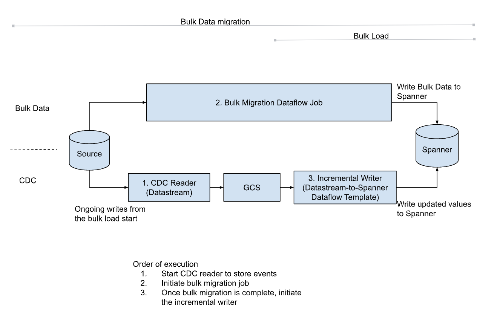

# End to end production migration
Here is the flow to perform a production migration
1. Create the Schema at target. 
2. Include indexes and Foreign keys while creating the initial schema here except foreign keys which cause a circular reference. As self-referencing/circular referencing keys are rare in most schemas (or low in number where they exist), the self-referencing/circular referencing keys should be created post migration.  \
An alternative is to create all the foreign keys post migration, which is not recommended owing to the rate limits on creating schema in Spanner.
3. Create a stream via [Datastream](https://cloud.google.com/datastream/docs/create-a-stream) and which will store the CDC events in GCS. Note that pubsub notifications on GCS need to be enabled in this step.
4. Run the bulk migration job ([Sourcedb-to-spanner](https://github.com/GoogleCloudPlatform/DataflowTemplates/tree/main/v2/sourcedb-to-spanner)) and wait for it to complete.
5. Once the bulk migration job is complete, Initiate the [Datastream-to-spanner](https://cloud.google.com/dataflow/docs/guides/templates/provided/datastream-to-cloud-spanner) dataflow job. (Can be automated using [job triggers](https://cloud.google.com/dataflow/docs/guides/job-notifications-using-eventarc))
6. Any data that was updated during the bulk migration will be re-applied by the incremental writer leading to an eventually consistent state. Post migration the data will be consistent.

## Running production migrations via terraform
The recommendation for running a production end-to-end migration
is using a combination of live and bulk Terraform templates.
This optimizes for speed and cost-effectiveness, especially when dealing
with large historical datasets. The live Terraform template can handle the
entire migration process, including historical data. However, migrating
large historical datasets solely with the live template can be slow and
expensive.

The steps to follow are:

1. **Change Data Capture Infra setup**
    - Begin by running the [Live Terraform template](../../datastream-to-spanner/terraform/samples/README.md) with the variables
        - `skip_dataflow` = true (This disables the creation of the Dataflow job for CDC data)
        - `enable_backfill` = false (This disables the backfill functionality within datastream)
    - This step sets up the necessary infrastructure for the migration but skips the dataflow job creation.

2. **Bulk Migration**
    - Run the [Bulk Terraform template](../../sourcedb-to-spanner/terraform/samples/README.md). This template will
      create Dataflow job(s) specifically designed for migrating
      historical data.
    - Monitor the Dataflow job until it completes. This step migrates the bulk of your historical data efficiently.

3. **Live Migration (with Dataflow)**
    - Once the bulk migration is complete, run the live Terraform template again, this time with the following
      variables:
        - `skip_dataflow` = false (This enables the creation of the Dataflow job for CDC data)
        - `enable_backfill` = false (Keep backfill disabled as it was handled in the bulk migration)
    - This step creates a Dataflow job that migrates the CDC data captured by Datastream.

Once Spanner is up to speed with the source instance, turn off the source instance and wait for Spanner to fully
catch up. Once caught up, cut over the application to use Spanner.
