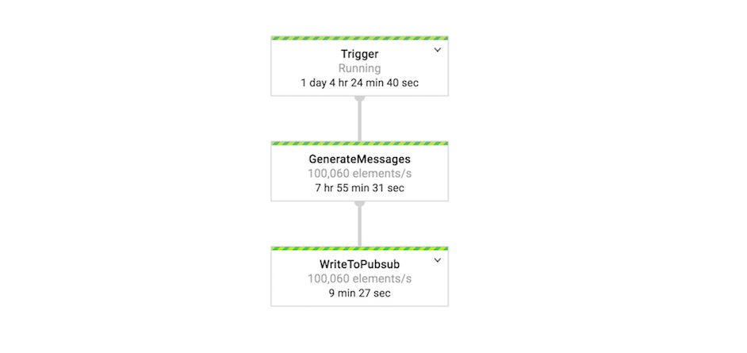

# Dataflow Streaming Data Generator
[StreamingDataGenerator](src/main/java/com/google/cloud/teleport/v2/templates/StreamingDataGenerator.java) - 
templates generates either unlimited or fixed number of synthetic records/messages based on user specified
schema template at a specific QPS, encodes as either Json/Avro/Parquet and writes to one of the sinks 
(PubSub/BigQuery/Google Cloud Storage) as per users choice. 

Following are few use cases:

1. Simulate large scale real time event publishing to Pub/Sub to measure and determine the number and size of
   consumers required to process published events.

2. Generate synthetic data to systems like BigQuery, Google Cloud Storage to run either performance benchmarks 
   / Proof of concepts.

Below table outlines supported sinks and output encoding formats:
 
|  | JSON | AVRO  | PARQUET |
| ---|:----:| :-----:|:-----:|
| Pub/Sub | Y | Y | |
| BigQuery | Y | |  |
| Google Cloud Storage | Y | Y | Y |

> Note the number of workers executing the pipeline must be large enough to support the supplied 
> QPS. Use a general rule of 2,500 QPS per core in the worker pool when configuring your pipeline.

## Sample Pipeline DAG


## Getting Started

### Requirements

* Java 8
* Maven 3
* One of the following depending on Sink Type:  
  &nbsp;&nbsp;PubSub Topic
  &nbsp;&nbsp;BigQuery Table  
  &nbsp;&nbsp;Google Cloud Storage Bucket   

### Creating the Schema File
The schema file used to generate JSON messages with fake data is based on the 
[json-data-generator](https://github.com/vincentrussell/json-data-generator) library. This library
allows for the structuring of a sample JSON schema and injection of common faker functions to 
instruct the data generator of what type of fake data to create in each field. See the 
json-data-generator [docs](https://github.com/vincentrussell/json-data-generator) for more 
information on the faker functions.

#### Example Schema File
Below is an example schema file which generates fake game event payloads with random data.

```javascript
{
  "eventId": "{{uuid()}}",
  "eventTimestamp": {{timestamp()}},
  "ipv4": "{{ipv4()}}",
  "ipv6": "{{ipv6()}}",
  "country": "{{country()}}",
  "username": "{{username()}}",
  "quest": "{{random("A Break In the Ice", "Ghosts of Perdition", "Survive the Low Road")}}",
  "score": {{integer(100, 10000)}},
  "completed": {{bool()}}
}
```

#### Example Output Data
Based on the above schema, the below would be an example of a message which would be output to the
Pub/Sub topic.

```javascript
{
  "eventId": "5dacca34-163b-42cb-872e-fe3bad7bffa9",
  "eventTimestamp": 1537729128894,
  "ipv4": "164.215.241.55",
  "ipv6": "e401:58fc:93c5:689b:4401:206f:4734:2740",
  "country": "Montserrat",
  "username": "asellers",
  "quest": "A Break In the Ice",
  "score": 2721,
  "completed": false
}
```

#### Example Schema file to generate Pub/Sub message with attributes
In scenarios that require the pub/Sub message attributes, payload fields and attribute fields can be specified as shown
below. In this example attributes represents both payload fields (eventId, eventTime) and non payload fields (appId,playerId) 
```javascript
{
    "payload": {
        "eventId": "{{put("eventId",uuid())}}",
        "eventTime": {{put("eventTime", timestamp())}},
        "username": "{{put("username ", username())}}",
        "ipv4": "{{ipv4()}}",
        "country": "{{country()}}",
        "score": {{ integer(0, 100) }},
        "completed": {{bool()}}
    },
    "attributes": {
        "eventId": "{{get("eventId")}}",
        "eventTime": {{get("eventTime")}},
        "appId": {{ integer(1, 10) }},
        "playerId": {{ long(900235, 99000990098) }},
    }
}
```
Based on the above schema, the message payload will be as shown below and attributes would be eventId, eventTime, appId, playerId
```javascript
{
  "eventId": "5dacca34-163b-42cb-872e-fe3bad7bffa9",
  "eventTimestamp": 1537729128894,
  "username": "asellers",
  "ipv4": "164.215.241.55",
  "country": "Montserrat",
  "score": 2721,
  "completed": false
}
```
* Note: Template checks for presence of "^\\{\"?payload\"?:.+\"?attributes\"?:.+" pattern to determine whether to populate attributes or not

#### Generate Avro Pub/Sub Messages
To generate Avro encoded Pub/Sub messages supply following additional parameters:  
&nbsp;&nbsp;--outputType=AVRO  
&nbsp;&nbsp;--avroSchemaLocation=gs://bucketname/prefix/filename.avsc
  
Below is the example of avro schema corresponding to above message schema:
```javascript
{
     "type": "record",
     "namespace": "com.example.avro",
     "name": "GameEvent",
     "fields": [
       { "name": "eventId", "type": "string",  "doc": "Unique Id representing event"},
       { "name": "eventTime", "type": "long", "doc": "Time of the event" },
       { "name": "username", "type": "string", "doc": "Player name" },
       { "name": "ipv4", "type": "string", "doc": "Ip Address of the origin server" },
       { "name": "country", "type": "string", "doc": "Country of event origin" },
       { "name": "score", "type": "int", "doc": "Represents game score" },
       { "name": "completed", "type": "boolean", "doc": "Indicates completion of game" }
     ]
}
```
** Schema should match with Avro 1.8 Specifications.

#### Write to BigQuery
  * Output table must already exists and table schema should match schema supplied to generate fake records. 
  * Supply following additional parameters:    
    &nbsp;&nbsp;--sinkType=BIGQUERY  
    &nbsp;&nbsp;--outputTableSpec=projectid:datasetid.tableid
  * Optional parameters are:   
    &nbsp;&nbsp;--writeDisposition=[WRITE_APPEND|WRITE_TRUNCATE|WRITE_EMPTY]. Default is WRITE_APPEND  
    &nbsp;&nbsp;--outputDeadletterTable=projectid:datasetid.tableid. If not supplied creates a table with name outputtableid_error_records 

Template uses Streaming Inserts method instead of load to write data to BigQuery. Streaming Inserts are not free and subject to quota limits.  
For more latest informatioon check [BigQuery docs](https://cloud.google.com/bigquery/streaming-data-into-bigquery)

#### Write to Google Cloud Storage
  * Output Bucket must already exists. 
  * Supply following additional parameters:    
    &nbsp;&nbsp;--sinkType=GCS  
    &nbsp;&nbsp;--outputDirectory=gs://bucketname/prefix/
    &nbsp;&nbsp;--outputType=[AVRO|PQRQUET]. If not specified default output is JSON. 
    &nbsp;&nbsp;--avroSchemaLocation=gs://bucketname/prefix/filename.avsc (Mandatory when Output encoding type is AVRO or PARQUET)
  * Optional parameters include:
    &nbsp;&nbsp;--windowDuration=< Duration of fixed window >. Default is 1m (i.e 1 minute)  
    &nbsp;&nbsp;--outputFilenamePrefix=< Prefix for each file >. Default is output-   
    &nbsp;&nbsp;--numShards=< Number of output files per window >. Must be specified as 1 or higher number

#### Writing fixed number of records
By default templates generates unlimited number of messages but however if you need fixed number of messages include
the option --messagesLimit=<number> to convert the pipeline from unbounded source to bounded source. 

### Testing Pipeline
The template unit tests can be run using:

```sh
mvn test
```
    
### Building Template
Flex templates containerize the pipeline code and defines template specification file.

#### Building Container Image
* Set environment variables that will be used in the build process.

```sh
export PROJECT=<my-project>
export IMAGE_NAME=<my-image-name>
export BUCKET_NAME=gs://<bucket-name>
export TARGET_GCR_IMAGE=gcr.io/${PROJECT}/${IMAGE_NAME}
export BASE_CONTAINER_IMAGE=gcr.io/dataflow-templates-base/java8-template-launcher-base
export BASE_CONTAINER_IMAGE_VERSION=latest
export TEMPLATE_MODULE=streaming-data-generator
export APP_ROOT=/template/${TEMPLATE_MODULE}
export COMMAND_SPEC=${APP_ROOT}/resources/${TEMPLATE_MODULE}-command-spec.json
export TEMPLATE_IMAGE_SPEC=${BUCKET_NAME}/images/${TEMPLATE_MODULE}-image-spec.json
```
* Build and push image to Google Container Repository

```sh
mvn clean package -Dimage=${TARGET_GCR_IMAGE} \
                  -Dbase-container-image=${BASE_CONTAINER_IMAGE} \
                  -Dbase-container-image.version=${BASE_CONTAINER_IMAGE_VERSION} \
                  -Dapp-root=${APP_ROOT} \
                  -Dcommand-spec=${COMMAND_SPEC} \
                  -am -pl ${TEMPLATE_MODULE}
```

#### Creating Template Spec

Create template spec in Google Cloud Storage with path to container image in Google Container Repository and pipeline metadata.

```json
{
	"image": "gcr.io/project-id/image-name",
	"metadata": {
		"name": "Streaming data generator",
		"description": "Generates Synthetic data as per user specified schema at a fixed QPS and writes to Sink of user choice.",
		"parameters": [
                    {
                        "name": "schemaLocation",
                        "label": "Location of Schema file.",
                        "helpText": "GCS path of schema location. ex: gs://MyBucket/file.json",
                        "is_optional": false,
                        "regexes": [
                           "^gs:\\/\\/[^\\n\\r]+$"
                        ],
                        "paramType": "GCS_READ_FILE"
                    },
                    {
                        "name": "qps",
                        "label": "Required output qps",
                        "helpText": "Messages to be published per second",
                        "is_optional": false,
                        "regexes": [
                            "^[1-9][0-9]*$"
                        ],
                        "paramType": "TEXT"
                    },
                    {
                        "name": "topic",
                        "label": "PubSub Topic name",
                        "helpText": "The name of the topic to which the pipeline should publish data. For example, projects/<project-id>/topics/<topic-name>",
                        "is_optional": false,
                        "regexes": [
                            "^projects\\/[^\\n\\r\\/]+\\/topics\\/[^\\n\\r\\/]+$"
                        ],
                        "paramType": "PUBSUB_TOPIC"
                    },
                    {
                         "name": "outputType",
                         "label": "Output Encoding Type",
                         "helpText": "The message Output type. Default is JSON",
                         "is_optional": true,
                         "regexes": [
                             "^(JSON|AVRO|PARQUET)$"
                         ],
                         "paramType": "TEXT"
                    },
                    {
                        "name": "avroSchemaLocation",
                        "label": "Location of Avro Schema file",
                        "helpText": "GCS path of avro schema location. Mandatory when outputType is AVRO or PARQUET. ex: gs://MyBucket/file.avsc",
                        "is_optional": true,
                        "regexes": [
                            "^gs:\\/\\/[^\\n\\r]+$"
                        ],
                        "paramType": "GCS_READ_FILE"
                    },
                    {
                         "name": "sinkType",
                         "label": "Output Sink Type",
                         "helpText": "The message Sink type. Default is PUBSUB",
                         "is_optional": true,
                         "regexes": [
                             "^(PUBSUB|BIGQUERY|GCS)$"
                         ],
                         "paramType": "TEXT"
                    },
                    {
                         "name": "outputTableSpec",
                         "label": "Output BigQuery table",
                         "helpText": "Output BigQuery table. For example, <project>:<dataset>.<table_name>. Mandatory when sinkType is BIGQUERY.",
                         "isOptional": true,
                         "regexes": [
                           ".+:.+\\..+"
                         ],
                         "paramType": "TEXT"
                   },
                   {
                     "name": "writeDisposition",
                     "label": "BigQuery Write Disposition",
                     "helpText": "BigQuery WriteDisposition. For example, WRITE_APPEND, WRITE_EMPTY or WRITE_TRUNCATE. Default: WRITE_APPEND",
                     "isOptional": true,
                     "regexes": [
                       "^(WRITE_APPEND|WRITE_EMPTY|WRITE_TRUNCATE)$"
                     ],
                     "paramType": "TEXT"
                   },
                   {
                        "name": "outputDeadletterTable",
                        "label": "Output Deadletter table",
                        "helpText": "Output Deadletter table. For example, <project>:<dataset>.<table_name>",
                        "isOptional": true,
                        "regexes": [
                          ".+:.+\\..+"
                        ],
                        "paramType": "TEXT"
                   },
                   {
                        "name": "windowDuration",
                        "label": "Fixed window Duration",
                        "helpText": "Window interval at which output is written to GCS. Default:1m (i.e 1 minute).",
                        "isOptional": true,
                        "regexes": ["^[1-9][0-9]*[s|m|h]$"],
                        "paramType": "TEXT"
                   },
                   {
                        "name": "outputDirectory",
                        "label": "Output Directory",
                        "helpText": "The directory to write output files. Mandatory when sink is GCS and must end with a slash. For example, gs://MyBucket/",
                        "isOptional": true,
                        "regexes": [
                          "^gs:\\/\\/[^\\n\\r]+$"
                        ],
                        "paramType": "GCS_WRITE_FOLDER"
                   },
                   {
                        "name": "outputFilenamePrefix",
                        "label": "Output Filename Prefix",
                        "helpText": "The filename prefix of the files to write to. Default:output-",
                        "isOptional": true,
                        "regexes": [],
                        "paramType": "TEXT"
                   },
                   {
                        "name": "numShards",
                        "label": "Number of Shards.",
                        "helpText": "Maximum number of output shards. Default:0 and should be set to 1 or higher number.",
                        "isOptional": true,
                        "regexes": [
                          "^[1-9][0-9]*$"
                        ],
                        "paramType": "TEXT"
                   },
                   {
                       "name": "messagesLimit",
                       "label": "Maximum number of output Messages.",
                       "helpText": "Maximum number of output messages. Default:0 indicating Unlimited.",
                       "isOptional": true,
                       "regexes": [
                         "^[1-9]\\d*$"
                       ],
                       "paramType": "TEXT"
                   },
                   {
                      
                       "name": "autoscalingAlgorithm",
                       "label": "autoscaling Algorithm",
                       "helpText": "autoscalingAlgorithm",
                       "isOptional": true,
                       "regexes": [
                         "^(THROUGHPUT_BASED|NONE)$"
                       ],
                       "paramType": "TEXT"
                   }         			
		]
	   },
	"sdk_info": {
			"language": "JAVA"
		}
}
```

### Executing Template
Below example publishes Avro encoded messages to Pub/Sub :
* schemaLocation: GCS Location of schema file in json format (e.g: gs://<path-to-schema-location-in-gcs>).
* qps: Queries Per Second
* outputType: AVRO
* avroSchemaLocation: GCS Location of avro schema file (e.g: gs://<path-to-schema-location-in-gcs>).
* pubsubTopic: PubSub Topic id.

Template can be executed using the following gcloud command:
```sh
TEMPLATE_SPEC_GCSPATH=gs://path/to/template-spec
SCHEMA_LOCATION=gs://path/to/schemafile.json
QPS=1
PUBSUB_TOPIC=projects/$PROJECT/topics/<topic-id>
OUTPUTTYPE=AVRO
AVRO_SCHEMA_LOCATION=gs://path/to/avroschemafile.avsc


export JOB_NAME="${TEMPLATE_MODULE}-`date +%Y%m%d-%H%M%S-%N`"
gcloud beta dataflow flex-template run ${JOB_NAME} \
        --project=${PROJECT} --region=us-central1 \
        --template-file-gcs-location=${TEMPLATE_IMAGE_SPEC} \
        --parameters schemaLocation=$SCHEMA_LOCATION,qps=$QPS,topic=$PUBSUB_TOPIC,outputType=$PUBSUB_TOPIC,--avroSchemaLocation=$AVRO_SCHEMA_LOCATION
```
 *Note*: Additional options such as autoscaling Algorithm,  max workers, service account can be specified in the parameters section as shown below:

 ```sh
  --parameters schemaLocation=$SCHEMA_LOCATION,topic=$PUBSUB_TOPIC,qps=$QPS,autoscalingAlgorithm="THROUGHPUT_BASED",maxNumWorkers=5,serviceAccount=$serviceAccount
```
